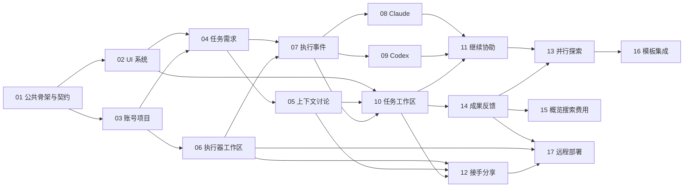

# 00｜完整目标的交付拆分与依赖

> D1 · 对应产品 v1.1 · 状态：计划。  
> [计划入口](README.md) · [产品路线](../product/07-roadmap.md) · [工作项索引](19-work-items.md)

## 1. 交付组织方式

以用户能够完成的动作组织开发，不按“后端全部完成、前端随后接入”分层排队。每个业务包都有 UI、数据、接口、必要执行能力和可展示产物。领域不为首期另做简化副本，后续继续、协助、并行使用同一个 Task。

开发阶段沿用 M0—M4，但工作包可以交叉开始。依赖表中的“依赖”指接入真实路径需要的基础，不要求前置包所有尾部整合项都完成；具体切分见第 8 节。页面和模拟器可以提前开发。文档不能作为已经通过运行测试的证据。

## 2. 从完整产品反推交付包

| 交付包 | 用户得到什么 | 涉及计划 | 产品阶段 |
| --- | --- | --- | --- |
| A 体验与共同骨架 | 打开工作台、项目、任务和成果，有一致导航与状态 | 01、02、03；10/14 的模拟页面 | M0 |
| B 真实单任务 | 一句话建任务，在自己的电脑运行一个工具，看到修改并标记完成 | 04、05 基础、06、07、08 或 09、10 基础、14 基础 | M1 |
| C 工具与人的协作 | 同一任务换工具、选择模型、临时求助、跨成员接手 | 08、09、11、12；05/10 完善 | M2 |
| D 完整项目与成果 | 需求、约定、依赖、并行方案、预览反馈和团队概览连起来 | 04 完善、05 完善、13、14、15 | M3 |
| E 日常运营与扩展 | 远程节点、复用模板、外部集成、费用、部署与恢复 | 16、17；15 完善 | M4 |

首个工具选择哪一个不改变总体设计；08、09 的适配器可由不同人并行开发。第二个工具不是远期装饰，C 包必须包括它。B 包已包含账号和项目骨架，不是一个将来需要推翻的纯个人产品。

## 3. 依赖图

14 的基础 Result 数据与只读成果先于 13；13 的成果引用直接复用，不再创建另一种结果表。05 的上下文装配不依赖一定有 AI 总结：纯规则装配先可用，因此不会与 08/09 形成循环。

## 4. 工作包依赖与边界

| 包 | 真正接入所需的前置基础 | 可提前开展的部分 | 主要交付物 |
| --- | --- | --- | --- |
| 01 | 无 | 全部 | 工程骨架、契约、迁移、模拟执行器 |
| 02 | 01 的目录约定 | 视觉与页面结构 | UI 包、AppShell、状态组件 |
| 03 | 01；页面使用 02 | 身份接口和数据库 | 账号、空间、项目、邀请 |
| 04 | 03、02 | 静态看板 | Task/Requirement、分工与完成 |
| 05 | 04 的 Task 基础 | 引用协议、素材编辑器 | 讨论、约定、上下文快照 |
| 06 | 01、03 的身份/权限 | OS 进程和 Git 封装 | 可注册执行器、WorkingCopy |
| 07 | 04、06 的执行基础 | 模拟派发和 reducer | Run、事件流、停止与授权 |
| 08 / 09 | 07 的接口、06 的进程能力 | 原生协议映射 | 两个独立适配器 |
| 10 | 02、04、05、07 | 全页面模拟 | 任务即执行工作区 |
| 11 | 05、07、08、09、10 的基础页面 | 协助面板与预检 UI | 同机继续、局部求助 |
| 12 | 03、05、06、07、10 的基础页面 | 分享预览与接手卡 | 跨人/节点接手 |
| 13 | 06、07、10、11、14-01 | 对比界面 | 分支与整合操作 |
| 14 | 04、05、07、10 的页面/结果接口 | 成果页模拟 | 成果版本、预览、反馈 |
| 15 | 03、04、05、07、14；协助/接手提醒再接 11/12 | 工作台布局 | 聚合视图、通知与搜索 |
| 16 | 05、07、11、13、14 | 连接器接口 | 模板、外部事件与引用 |
| 17 | 06、07、12、14；01 的最小部署 | 安装打包方案 | 可运营部署与远程节点 |

## 5. 首次开工建议

第一批领取 `HX-DEV-01-01` 技术基线、`01-02` 骨架、`01-03` 公共契约；设计可同时开展 `02-01` 与 `02-02` 的视觉草案，代码接入按其前置项推进。只有概念设计时也可先做界面，但必须标记模拟状态，不把按钮做成永远返回成功。

第二批进入 `03-01` 身份、`03-03` 空间访问、`04-01` Task 基础和 `06-01` 执行器入口。随后从创建任务打通到第一次真实 Run，而不是继续堆配置页面。

第一个实际功能演示：创建“订单按月份导出”→选择本机和获准工具→看到步骤及代码→在成果里回复→成员标记完成。无需先建验收中心、正式需求审批或外部项目管理系统。

## 6. 并行开发约定

契约和数据库迁移由本轮指定的整合负责人协调，不要求固定新岗位。开发者与 AI 在各自分支/工作区工作，按计划限制改动路径。跨边界变化先修改 01/18 的草案及对应代码契约，再通知使用方。

推荐分支格式 `dev/hx-dev-11-03-assistance`。PR 描述写工作项、改动路径、依赖、真实/模拟范围和运行方式，不要求填写产品价值研究报告。不要为同一功能重复造账号、Task、结果和通知系统。

状态记录由内部使用的 issue 工具或 PR 承接。本次仅给出可领取工作项，不自动在 GitHub 创建 102 个 issue，也不替公司分配人名和日期。

## 7. 完整范围的覆盖

HX-F01→03/06/17；F02→04/05；F03→04/15；F04→02/10/12；F05→08/09/11/13；F06→05/12；F07→16；F08→05/15；F09→14；F10→15；F11→03/06/07/17；F12→15/16。

不存在以“后续再评估”为名丢掉核心协作能力，也不存在把已移出范围的验收引擎偷偷放进 M4。日期和投入由团队根据实际人员确定；这里给出顺序与边界，不承诺工期。

## 8. 防止把包级依赖误读为循环等待

03-05 是首次使用的尾部整合，04/06 只需要 03 的身份、空间和权限基础，不等待整个入门向导完成。04-04 使用 05 的材料/草稿接口，而 05 只依赖 04-01 的 Task 基础，不依赖完整需求编辑器。

06 的写入控制与 07 的派发可以按 01-03 的契约并行实现，再进行真实整合；两者不是互相等待整包完成。08/09 同样可以在 07 接口确定后使用模拟宿主开发。

11/12/14 所需的任务页面基础是 10-01—04 与公共动作接口；10-06 是最终整合项，不是它们的前置。13 的最低成果依赖是 14-01，不需要先做完在线预览和全部反馈页面。

15-01/02 可在任务与成果基础完成后先落地；15-03 中的协助、接手提醒再接 11/12。17-02 的跨环境准备依赖 12 的恢复能力，而 01-06 的最小部署不依赖整个 17。
