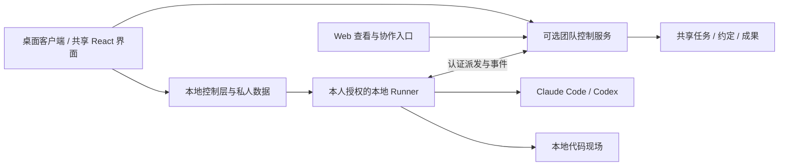

# ADR-0008｜桌面优先、可选团队服务与 Web 协作入口

日期：2026-09-26（UTC+8）。状态：**产品形态已决定；桌面框架与安装分发未选定、未实现**。

关联 `HX-DEV-01-01/02/06、02-02、06-01/05/06、10-01/03/04/05、17-01/04`。不新增或替换原 102 项编号。

## 1. 决定

HEXU 采用**以桌面客户端为开发者主要入口的 C/S 架构**，个人工作不依赖团队服务器；加入团队后连接共享控制服务。保留 Web 入口，方便成员查看任务、资料、成果并讨论、反馈和执行有权限的操作。

桌面、Web 与 Runner 复用同一业务模型、契约和 UI 组件，不发展三套任务系统。Web 加本地 Runner 是有效的阶段性交付方式，现有 React/Vite 工作区继续开发和复用。

这项决定不代表已经选用 Electron 或 Tauri，不要求立刻重写界面或执行器。用户确认的沉浸式工作台是[设计语言](../design/README.md)，不是桌面 SDK、Shell 权限或远程协议的选型证明。

## 2. 两个使用场景

| 场景 | 目标体验 | 数据与执行归属 |
| --- | --- | --- |
| 个人多工具编程 | 安装后从问题或授权目录开始，持续使用自己的工具与模型；不要求企业邮箱、加入团队或部署服务器 | 私人任务和本地记录由本地控制层保存，工具、代码和凭证留在获授权的运行环境 |
| 团队 AI 编程协作 | 开发者在各自电脑继续工作，同事可从桌面或 Web 参与讨论、约定、成果和接手 | 团队共享状态由团队服务保存；模型凭证、完整原生历史和代码现场不因加入团队自动上传 |

不依赖团队服务器不等于模型可离线工作，模型调用是否联网由具体工具和账户决定。个人内容转团队应明确选材与归属，不自动公开私人历史，也不在本次决定中引入通用双向离线同步引擎。

## 3. 职责边界

这是目标结构，不表示当前回环协议已支持跨电脑连接。

- **界面层**：共享任务、执行、上下文与成果视图。桌面可以增加目录选择、窗口、通知和 IDE 衔接，但不能在渲染层直接访问数据库、密钥或启动任意进程。
- **控制层**：复用任务、权限、Run、Operation、幂等与事件规则。私人数据和团队数据分别归属，不能把 preview 示例库重新标为正式个人或团队库。
- **Runner**：保留独立的进程、目录、适配器、凭证与恢复职责。安装器可统一安装和管理它，但窗口关闭、退出登录、心跳过期都不是进程已终止的证明。
- **团队服务**：拥有共享协作状态，不默认取得成员电脑、模型账户或完整仓库的控制权。Web 获得任务权限不等于获得节点执行权限。
- **远程执行环境**：是额外的受授权节点选项；不是 Web 用户必须把全部代码上传服务器的前提。

## 4. 现有代码如何延续

| 现有模块 | 延续方式 |
| --- | --- |
| `apps/web`、`packages/ui` | 作为共享 React 界面与组件基础；按 W1 渐进迁移，不重建另一套桌面业务前端 |
| `packages/client`、`contracts` | 保留能力化客户端边界；未来本地桥与远程传输消费同一业务契约 |
| `apps/control`、`domain`、`db` | 保留 Task/Run/Operation 和状态规则；本地运行与团队部署是宿主形态差异 |
| `apps/runner`、`packages/adapters` | 沿用明确的本机授权、原生工具协议、会话和工作区锁，不迁进 UI 点击处理器 |

当前工程基线仍是 Node 24、npm、TypeScript、React/Vite、Fastify 和分模式 SQLite。PostgreSQL、HTTPS/WSS、自托管部署、桌面打包及系统凭证管理分别按工作包交付，不因本文自动变成已支持能力。

## 5. 桌面技术选型的未决部分

Electron / Tauri 均未定。选型时需要用已有 Node Runner 核对：Windows/macOS/Linux 的工具发现与进程管理、终端承载、受控本地通信、会话存储、安装升级、包体与维护成本。不能只依据截图、UI 组件推荐或包体大小做决定。

先记录小范围可复现结果，再在本 ADR 补充实际选型与支持平台；无需提前把候选框架、Monaco、xterm 或 node-pty 全部加进依赖。正式 UI 增量仍沿用项目风格和现有组件。

Windows 是需要独立解决的原生执行兼容问题。桌面壳跨平台，不代表现有 POSIX 进程管理、私有凭证目录和停止恢复已经跨平台。

## 6. 交付顺序与事实口径

先让现有任务工作区中的真实个人 coding 路径和双工具连续工作可用，再实现桌面安装／启动／本地集成；团队服务与 Web 共用已有协作模型按需补齐。每个纵向功能同时交付相应 UI，不先扩展通用管理后台。

截至本次同步的 E2c1，应用仍只有回环 preview / team-local 和独立节点实验路径；Codex 保留会话及显式恢复有工程实现，真实账户互操作仍未验证。无桌面安装包、正式纯个人客户端或跨电脑团队平台。最新范围始终见 [21](../development/21-implementation-status.md)，不得用本 ADR 或演示图覆盖进度记录。

后续改动若改变主入口、数据归属、跨端复用或执行边界，更新本 ADR 与对应契约／工作项。普通实现细节自主判断，不增加每次开发都要审批的流程。
