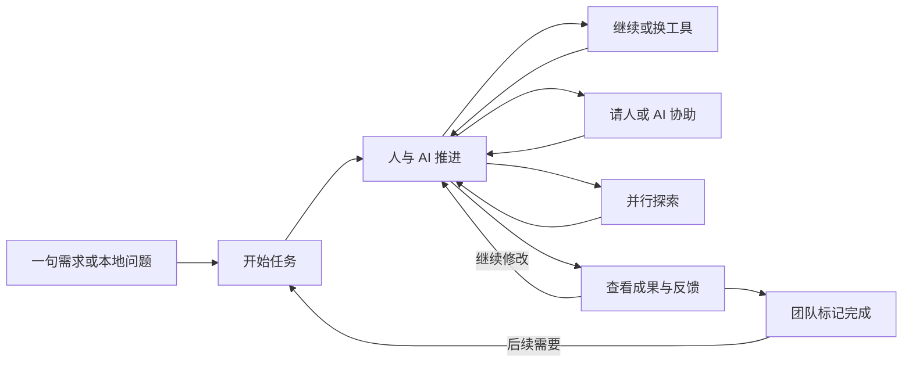

# 01｜总体产品规划

> 规划基线 v1.1 · 2026-09-25 · 完整产品目标，尚未实现。  
> [返回入口](../../README.md) · [人和工作旅程](02-people-and-workflows.md) · [功能规格](03-functional-specification.md) · [本轮复盘](09-planning-revision.md)

## 1. 产品定义

**HEXU · 合序是面向人和 AI 的研发协作工作台。**

产品类别为 AI 研发协作平台，品牌主张为“让人和 AI，一起交付”。它把分散在成员、工具、模型和开发环境中的工作连接起来，让任务能够持续推进，团队可以随时参与并看到成果。

用户来这里做事，不是维护一套管理数据。HEXU 不以聊天窗口、Agent 数量或验证制度作为核心，而以一项工作从开始到继续、协作和呈现成果的连续体验作为核心。

**管理要轻，协作要深，成果要直观。**

## 2. 已明确的建设条件

| 条件 | 产品回应 |
| --- | --- |
| 公司决定自主建设 HEXU | 自主定义产品和领域，不预设 fork 某个平台；合理复用基础组件 |
| 团队正在转向 AI 开发，协作较混乱 | 产品帮助形成必要工作共识，不要求先完成组织流程改革 |
| 没有完善内网或现成需求管理也要使用 | 可访问的网页入口、基础账号、原生项目与需求能力 |
| 成员继续使用自己的开发环境 | 本地执行为一等路径，远程节点可选，不强制云端化 |
| 个人需要多工具、多模型协作 | 优先 Claude Code 与 Codex，保留原生能力和工具选择 |
| UI 与第一眼印象重要 | 管理首页、任务工作区、成果页与核心逻辑同步设计 |
| 需要完整最终目标 | 蓝图覆盖全部工作体验，建设可以分阶段推进 |
| 验证与效果评估由内部团队负责 | 产品减少验证环节，不把测试、证据和审批建成默认门槛 |

人数、操作系统、仓库平台、技术栈和预算尚未指定；不虚构这些条件，也不因此阻止产品设计。具体选型留在技术决策中，不变成用户必填流程。

## 3. 核心价值与问题边界

### 不用反复解释

当用户换模型、换工具或请同事参与时，目标、必要资料、已形成的约定、当前代码与剩余问题可以跟随任务。系统自动整理，用户能检查和修改。

### 不用反复追问

相关成员看得到谁正在推进什么、等待谁、发生了哪些重要变化。任务和实际执行相连，不需要每天再维护一份汇报状态。

### 不用四处找成果

从同一个任务找到讨论、代码变更、功能预览、文件和结果说明。团队直接反馈、继续或标记完成，质量判断由团队掌握。

这些是设计目标，不是已经测得的效率结论。具体效果评估由内部团队安排，不在产品内建设实验管理和强制指标体系。

## 4. 三类关系，统一围绕工作

**人与人：**共享必要的工作意图、接口约定、进展和成果，方便临时协助与接手，不公开所有私人探索。

**人与 AI：**可以委派，也能补充、纠正、停止和继续；计划与总结可直接编辑，不把交互压缩成批准或拒绝。

**AI 与 AI：**围绕明确任务进行接力、建议和并行探索，共享必要材料而不是默认全员广播；权限和实际写入范围仍清楚。

特别关注跨关系的断点：一个人在自己的会话里形成的决定，会影响其他人及其 AI。使用“设为项目约定”和相关任务提醒解决，不要求每个决定都走正式评审。

## 5. 核心体验：开始、让别人参与、呈现成果

这里没有强制需求审批、统一测试、正式验收、批准发布的固定流水线。需要时可以附检查报告、关联内部流程或执行受授权的发布动作，但不把所有工作都变成多级流程。

简单修复直接开始；较大需求再补说明、拆分任务和安排里程碑。分析或讨论任务不要求先建立代码仓库；真正读写代码时需要有权限的工作现场。

## 6. 产品的四个工作区域

| 区域 | 用户主要做什么 | 与其他区域的关系 |
| --- | --- | --- |
| 工作台 | 继续自己的工作、回复事项、了解团队目标和成果 | 聚合同一套任务，不另建汇报系统 |
| 项目 | 组织需求、任务、资料、约定、成员和里程碑 | 内置轻量管理，外部系统是可选接入 |
| 任务工作区 | 使用 AI、补充上下文、查看代码、继续、协助和并行 | 从任务直接进入，不另建孤立 AI 工作区 |
| 成果 | 查看预览、文件和变更，反馈、继续、标记完成 | 可从任务内查看，也可跨项目汇总 |

四个工作区域不意味着四个并列主菜单：任务工作区从任务进入。全局一级导航保持“工作台、项目、成果”，知识以项目资料为主，集中检索与资源设置作为辅助入口。

工具、模型、账号、节点与集成在任务需要时就地选择，集中管理放在资源设置中。个人与管理者的默认视图不同，但对象、状态和权限来源相同。

## 7. 多工具协作的产品中心

### 继续：不重新开始

同一任务换执行工具或模型，准备必要上下文与代码状态。常见本机接力自动完成准备，不每次要求填写交接表。跨节点或出现冲突时才处理相应问题。

### 协助：不转移整个任务

选择一个报错、文件、方案或代码变更，请同事或另一个 AI 帮忙。主执行与负责人不变；回应回到任务中，可采用、编辑或忽略。临时协作不被误建成正式交接。

### 并行：看得清不同结果

在独立工作区或明确的非写入分支中探索不同方案、完成可拆分工作。展示每条分支的目的、状态和成果，让用户选择继续或整合，不只提供更多窗口。

单工具持续执行仍是默认路径，不强迫用户每次选择多 Agent 模式。工具与模型选择清楚区分，支持范围由适配器声明，不承诺所有模型与工具任意组合。

## 8. 完整能力地图

| 编号 | 最终能力 |
| --- | --- |
| HX-F01 | 团队、项目、成员邀请和接入引导 |
| HX-F02 | 自然语言需求、可编辑工作说明与修订 |
| HX-F03 | 任务、分工、依赖、看板和轻量里程碑 |
| HX-F04 | 个人探索与任务研发工作区 |
| HX-F05 | 多工具多模型的继续、协助、并行与配置 |
| HX-F06 | 成员协作、跨人接手、约定变化提醒 |
| HX-F07 | 可复用工作方式和有边界的自动化 |
| HX-F08 | 项目资料、团队约定与自然携带的上下文 |
| HX-F09 | 成果展示、反馈、完成记录及可选发布关联 |
| HX-F10 | 工作台、相关提醒、团队概览与费用来源 |
| HX-F11 | 本地和远程执行节点、权限与基本维护 |
| HX-F12 | Git、可选外部系统、全局搜索及扩展 |

完整性体现为工作能从想法走到成果，不体现为每个模块都有独立后台。

## 9. 人的主导权与使用负担

默认真人负责人由创建或发起动作自动带入；不要求每次再指定需求确认人、验收人和发布人。需要独立岗位与流程时，由团队按自己的方式组织。

个人探索可以直接开始，转团队时选择分享范围。项目可见不等于私人电脑可控；分享结果不等于分享所有会话或账号。

AI 的计划、任务拆分、上下文摘要与结果说明可局部编辑。常规操作在有限授权内连续完成，权限扩大、实际破坏性操作或跨边界分享再明确提示。

通知只打扰需要采取行动的人；同因消息合并，普通进展可以摘要。产品不按在线时长、token、代码行数或 Agent 数量排名员工。

## 10. 完成、成果与质量的边界

默认任务状态为“待处理、进行中、已完成”。等待回复、受阻和暂缓是附加信息。用户可以标记完成、重新打开或新建后续任务，不必先完成平台验收。

AI 执行结束是技术事实；团队标记完成是工作决定；代码发布是另一项实际操作。HEXU 如实展示它们，不负责认定三者等价。

成果、检查附件和评论保留版本。新代码出现时不把旧检查结论说成新结论，但也不自动取消旧任务的完成记录。是否重测、是否验收、是否发布，由内部团队评估。

产品不建设默认强制证据链、质量评分、研发实验平台或多级验收中心。现有内部工具、人工检查和可选 CI 可以继续使用并按需关联。

## 11. 部署与自研范围

客户端形态按 [ADR-0008](../engineering/adr-0008-client-surfaces.md) 确定：桌面是开发者的主要入口，个人工作不依赖团队服务器；团队服务可部署于允许的云或自管环境，并提供 Web 查看与协作入口。桌面和 Web 复用 UI 与同一业务模型，本地执行器保持独立职责。远程节点提供另一种运行方式，不要求先有 VPN、企业内网或 Kubernetes。桌面框架尚未选定，现有 Web + Runner 路径继续复用。

自主掌握任务连续性、协作动作、上下文与统一体验；复用 Git、成熟界面组件、数据库和原生 AI 工具。既不从零重写通用基础，也不拼接多套平台的任务系统。

任务信息、代码版本、原生执行和外部结果各有来源。失联、未支持或缺少费用时如实显示，不用假数据弥补体验。权限、正确停止和避免覆盖是基础产品能力，不是可删除的验证环节。

## 12. UI 方向与非目标

采用 [Workbench W1](../design/README.md) 的暗色优先、青色强调与完整浅色主题。首页突出实际工作和成果，任务页突出继续、协助与并行，成果页突出预览和反馈。高级设置按需展开，常用动作直接可见；个人与团队共享设计语言，管理页面不强行采用 IDE 多窗格。

不做员工监控系统、虚拟公司组织图、通用办公套件、完整 IDE、基础模型或代码托管平台；不把重型流程设计器作为基本能力。

已确认的工作台演示作为 W1 视觉参考；Figma 的求助、交接和项目管理信息结构选择性采用。样图不能定义生产能力、任务状态或账户权限。首次欢迎页可以使用品牌展示，日常工作台不以山景、机器人墙或无依据的进度数字作为主内容。

## 13. 建设顺序与维护

先确立核心页面和统一模型，再实现任务工作区、跨工具与真人协作、项目到成果的完整体验，最后拓展远程运行与模板。详细顺序见 [07](07-roadmap.md)，内部评估另行组织。

用户旅程、功能、状态和 UI 需同步修改。新增必填项或审批步骤必须说明具体用户价值，不能因工程上容易加字段就扩大用户负担。
