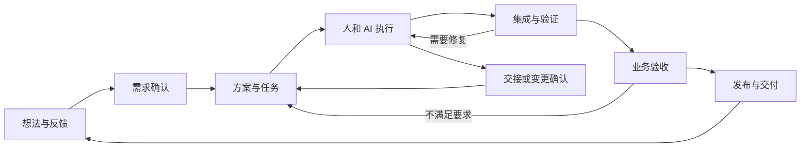

# 01｜总体产品规划

> 规划基线 v1.0 · 2026-09-25 · 本文描述完整目标，所有能力均为规划，不能据此宣称已实现。  
> [返回入口](../../README.md) · [人和工作旅程](02-people-and-workflows.md) · [功能规格](03-functional-specification.md)

## 1. 产品定义

**HEXU · 合序是以人为核心、以任务为连续载体的 AI 研发协作平台。**

它连接需求、成员、AI 工具、模型、工作环境、代码、决策和验收，让一项工作能在不同执行者之间可靠地推进。品牌主张为“让人和 AI，一起交付”。

HEXU 不是模型排行榜、终端聚合器或员工监控系统。产品的基本单位不是一次聊天，而是一项有目标、责任、产物和验收依据的工作。

## 2. 已确认的产品条件

| 条件 | 规划响应 |
| --- | --- |
| 自主建设 HEXU | 独立设计产品与领域，不预设 fork 某个已有平台 |
| 服务正在采用 AI 开发的团队 | 个人使用有直接价值，第二位成员参与时即产生协作价值 |
| 不假设已有完善内网与需求管理 | 网页可部署于可用的云或自管环境，内置轻量需求入口 |
| 成员仍在各自电脑开发 | 本地执行是一等路径；远程执行是另一选项而非强制迁移 |
| 优先考虑 Claude Code 和 Codex | 统一任务与结果，保留原生工具差异，不强制重写 Agent |
| UI 影响产品认可和采用 | 管理概览、任务工作台和验收页与后台逻辑同步设计 |
| 要有完整最终目标 | 本文定义全部能力；分阶段实施见 07，不拿首期代替愿景 |

操作系统分布、团队规模、既有 Git 平台、模型授权方式、部署预算和开发技术栈仍未确认。文中相关选择均作为建议或待验证项处理。

## 3. 核心问题与产品假设

### 3.1 人与人：工作意图和决定不容易流转

假设场景：两位开发者各自与 AI 达成不同接口约定，代码没有文本冲突，业务组合后却不能运行；或者某项兼容性决定只留在私人会话里，后来被另一项重构删除。

HEXU 要让影响他人的承诺、依赖和决定可见，而不是直播全部工作过程。正式任务始终有真人责任人；讨论、批准与执行留有来源。

### 3.2 人与 AI：委派之后缺少可控的过程

假设场景：用户让 AI 完成一个功能，却没有明确边界；AI 已退出，但测试没有跑；执行遇到权限问题，人不知道在哪里回复。

HEXU 要把目标、范围、授权、阻塞与验收组织起来，减少重复确认，同时把真正需要判断的事项交给正确的人。

### 3.3 AI 与 AI：沟通不等于协作

假设场景：一个 Agent 说接口完成，另一个却不知道对应提交；多个 Agent 互相改代码，原本的小任务变成无法收敛的循环。

HEXU 要用版本、输入输出约定、依赖和权限约束协作，支持独立工作区、集成检查、预算与迭代限制。不是把所有模型放进群聊。

### 3.4 跨关系断点：局部决定没有成为全局约束

最值得验证的场景是：甲批准了一个变化，但乙及其 AI 仍按旧前提工作。平台需要区分“已通知”“已阅读”“相关执行已确认新上下文”，不能认为共享文档更新等于所有 Agent 已经理解。

上述场景是产品假设与设计输入，不是已经完成的实地研究结论。采用和价值验证见 07。

## 4. 最终产品结果

用户应当能回答六个问题：

**我们要做什么？谁负责？现在依据什么决定？工作现场在哪里？什么需要我介入？凭什么确认已经交付？**

完整链路：

简单修复可以合并步骤；复杂需求可以增加方案评审；高风险变更需要更严格授权。模型、工具或运行配置改变时，任务身份不变，但新增执行记录。

## 5. 三个核心产品表面

### 5.1 团队工作台

为需求提出者、负责人和管理者提供项目、需求、任务、待决策事项、里程碑、风险与交付成果。没有研发工具安装要求。

管理概览从真实任务与验收记录推导，不要求开发者再填一份汇报状态。没有可靠口径时不显示精确进度百分比。

### 5.2 研发工作区

围绕任务整合上下文、AI 协作、代码差异、终端、预览和验证。允许使用外部 IDE；用户不必把所有编码迁到网页。平台外的活动只在明确支持且经授权的范围内同步，不假装已全面追踪。

### 5.3 执行连接器

本地执行器连接成员机器和原生工具；远程执行节点提供可持续运行的环境。节点属于个人或团队，控制权与任务可见性分离。

个人电脑离线后，网页仍能展示已同步内容，但不能承诺接管未保存的进程现场。跨环境恢复依赖检查点，而非任意进程迁移。

## 6. 十二个完整能力模块

| 编号 | 模块 | 最终能力与价值 |
| --- | --- | --- |
| HX-F01 | 团队与项目起步 | 邀请成员、建立项目、连接仓库与环境、引导新成员进入工作 |
| HX-F02 | 需求中心 | 原始输入、AI 整理、确认与版本、验收项、变化影响 |
| HX-F03 | 任务与规划 | 分工、真人责任人、依赖、影响范围、里程碑与阻塞 |
| HX-F04 | 个人探索与研发工作台 | 轻量启动、转团队任务、代码与预览、原生 IDE 衔接 |
| HX-F05 | 多工具与多模型 | 能力发现、配置、同任务接力、独立复核、并行比较 |
| HX-F06 | 团队协作与交接 | 评论、关注、决定传播、检查点、接手确认与写入控制 |
| HX-F07 | AI 工作流 | 明确分工、依赖调度、有界自动化、预算和人工接管 |
| HX-F08 | 知识与决策 | 有版本的规则、有效性、来源、权限、任务上下文与可复用流程 |
| HX-F09 | 验证、验收与交付 | 测试、预览、人工接受、版本关联、发布记录与反馈 |
| HX-F10 | 注意力、管理与成本 | 待决策队列、可解释风险、交付视图、估算与实际费用分开 |
| HX-F11 | 执行资源、权限与运维 | 节点、运行隔离、授权、恢复、审计、备份与数据管理 |
| HX-F12 | 集成与扩展 | Git、需求系统、通知、API 和 Webhook，避免重复维护事实 |

模块详细规则与验收在 03；不要仅按菜单数量判定完成。

## 7. 个人与团队使用同一套任务基础

个人可以从“分析这个问题”直接开始，不必先创建项目计划。私有探索有自己的任务、执行和产物，只是不自动成为团队承诺。

当需要同事参与时，用户主动选择共享范围、关联项目、确认目标、指定真人责任人，并预览将共享的材料。私有草稿保留，不能因为任务转团队就把全部历史会话公开。

团队可以直接从正式需求开始，也可以接纳已有个人探索的成果。两条路径最后进入相同的代码检查点、验收与交付记录。

**个人价值不是团队功能的试用品；团队协作也不是个人窗口的共享链接。**

## 8. 多工具协作的产品承诺

支持四种模式：一个工具持续执行；跨工具接力；针对固定版本独立复核；在隔离环境并行探索。

工具、模型、账号配置、执行环境和运行记录分别表达。只展示实际可用组合；新模型不默认取得原来工具的权限。选择建议可被覆盖，自动切换也要受成本和数据发送策略约束。

可迁移的是目标、决定、文件与版本、尝试记录、未解决问题和可验证产物。原生会话能恢复时恢复，不能恢复时明示新会话。不承诺隐藏内部状态或跨工具完整语义无损迁移。

复核结果属于意见与证据的一部分，不是多个 AI 投票后自动合并。

## 9. 人的控制与协作制度

责任人决定如何推进并对交付负责；操作者可以委派执行但不能超出授权；验收者针对具体版本接受结果；发布者控制上线。小团队允许角色兼任，记录仍须分开。

系统按风险逐步增加约束，而不是所有任务都走重流程。正式需求确认、工作交接、危险操作和验收是关键介入点；普通文件编辑在有效策略内可以连续执行。

需要人处理的事项显示原因、相关任务、后果和可选动作。过多提醒也是产品缺陷，优先合并通知、去重和按责任路由。

产品不以 AI 数量、输出字数、token 或在线时长给人打分。管理可见的是工作承诺与成果，不默认公开全部个人思考和失败尝试。

## 10. 信息与代码的权威来源

HEXU 原生需求、任务、决定和验收在平台管理；仓库内容与分支以 Git 为准；测试事实来自真实执行结果；模型账单来自可核对的提供方记录。

外部系统接入时，每种对象必须指定权威来源与同步方向。同一需求不能默认允许两端无约束编辑。索引和摘要只能引用事实，不能取代原始证据。

事件、会话内容和工具输出可能存在遗漏、延迟或敏感数据。界面要显示最后同步时间、来源与范围。数据归属和保留策略须在团队启用时明确。

## 11. UI 与体验的最终要求

产品应让初次使用者看懂目标和成果，也让重度开发者获得足够工作空间。优先打磨管理首页、需求页、任务工作台、协作视图和验收页。

视觉上采用统一设计系统，信息上区分人类确认、AI 建议、系统检测和未知状态。默认浅色、提供深色工作区；具体配色和密度在可用性验证后定稿。

所有功能必须同时设计空状态、加载、失败、权限不足、断线和恢复。演示数据明确标识，不伪装真实成果。

## 12. 非目标

HEXU 不训练基础模型，不替代完整 IDE，不在首要范围内建设全新的 Git 托管服务，不扩展为 HR 或通用办公平台，不默认提供 AI 员工排行榜。

不要求采用某个供应商；不建立个人订阅共享池；不绕过工具权限与授权；不承诺一键自动解决语义冲突、任意回滚业务数据或完全无人负责的交付。

公网可访问、自托管、代码在本地、数据不出组织是不同概念，不能互相替代。

## 13. 成功定义

核心结果是：**在相同质量要求下，更多真实任务能够被可靠接手和完成验收，同时减少重复解释、等待与返工。**

观察交接成本、等待决策时间、交付周期、验收覆盖、变更返工、缺陷和平台操作负担。使用次数、Agent 数量和任务拆分数量不能单独证明价值。

最终产品完成标准是 07 中的端到端验收，不是本文全部名词都出现在导航栏中。

## 14. 规划效力与变化管理

本规划是产品基线，不替代真实用户研究、法律核对或工程验证。功能与状态变更要关联原因、影响和验收更新；技术建议未被批准前，不应被自动当成不可改变的约束。

在开发阶段可以缩小单次交付范围，但不能用一个多工具启动器宣布已达成完整团队产品目标。
