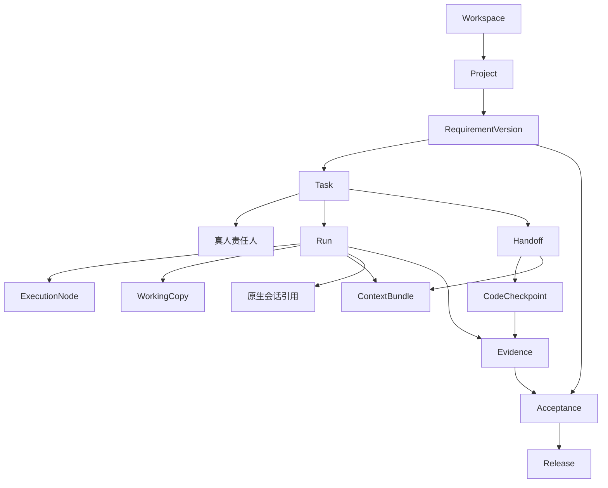
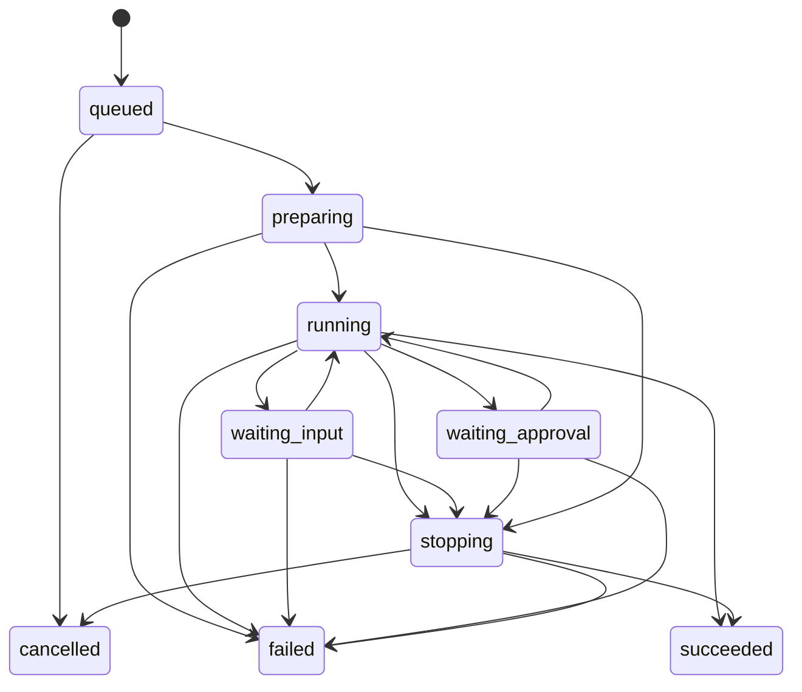

# 05｜领域模型与状态规则

> 规划基线 v1.0 · 2026-09-25 · 本文是术语、状态和一致性的统一口径，不是已落地数据库设计。  
> [返回入口](../../README.md) · [功能规格](03-functional-specification.md) · [架构与安全](06-technical-architecture.md)

## 1. 五个必须分开的概念

**任务 Task：**持续存在的工作承诺。

**执行 Run：**使用固定配置推进任务的一次受管执行。

**原生会话 Native Session：**Claude Code、Codex 等工具自己的上下文会话，未必与 Run 一一对应。

**工作区 Working Copy：**某个节点上的代码与运行现场。

**交付 Delivery：**经相应人员和策略接受、关联证据与版本的成果。

一个任务可以有多次执行与多个工作区；一个原生会话可以被多次 Run 继续；多个任务也不能随意共享一份正在修改的现场。所有外部会话 ID 均带工具、节点和账号配置范围，不用一个裸 ID 认定相同会话。

## 2. 核心对象

| 对象 | 关键内容 | 约束 |
| --- | --- | --- |
| Workspace | 团队、成员、策略与数据边界 | 所有团队对象归属明确，禁止跨工作空间隐式访问 |
| Membership | 用户、角色、项目范围、状态 | 账号存在不等于拥有所有项目权限 |
| Project | 目标、仓库、资料、环境与交付 | 可多仓库；不能默认绑定一个目录 |
| RequirementVersion | 原始需求、正式内容、验收项、确认人和版本 | 已确认版本不可原地覆盖 |
| Task | 目标、范围、责任人、操作者、依赖、状态、当前修订 | 团队任务可执行前必须有真人责任人 |
| AgentProfile | 工具、模型偏好、账号引用、权限和运行配置 | 只是配置，不替代真人责任 |
| ExecutionNode | 节点所有者、授权范围、环境、能力和健康 | 私人节点不会因管理员角色被自动共享 |
| WorkingCopy | 节点、仓库、分支、基线、目录、写入持有者 | 同一受管现场默认一个写入型执行者 |
| Run | 任务、工具版本、配置快照、节点、原生会话引用和生命周期 | 配置与输入快照不可随当前设置被覆盖 |
| ContextBundle | 需求／规则／决定版本、引用、摘要、排除和截断说明 | 权限过滤，来源与信任等级明确 |
| CodeCheckpoint | 仓库版本集合、补丁／选定文件、摘要哈希、环境要求 | 不自动包含所有未追踪文件或密钥 |
| Decision | 决定内容、理由、范围、来源、确认人与生效版本 | AI 提议不等于正式决定 |
| Handoff | 来源与目标执行者、检查点、上下文、接手条件和确认 | 发布、接受和启动新执行是不同动作 |
| ApprovalRequest | 具体动作、范围、资源、运行、期限、策略与决定 | 一次授权不能被移用于另一个动作 |
| Evidence | 验证类型、版本、环境、输出、来源和有效性 | 自报成功不冒充真实测试结果 |
| Acceptance | 需求与代码版本、证据集合、接受者、结果、剩余风险 | Agent 不直接成为正式业务验收者 |
| Release | 交付版本、目标环境、批准、部署结果与恢复说明 | 合并、验收、发布三者分离 |
| ActivityEvent | 来源、主体、对象、序号、时间、关联与幂等键 | 原始工具文本不能作为授权事实 |

名称是概念边界，不要求每个对象都建成独立微服务。实现可使用关系表与必要的结构化字段，但需要保留这些可区分性。

## 3. 关系图

图仅表示核心关联，不限制完整的多对多实现。一个跨仓库检查点是各仓库版本的集合，不是一个万能提交号。

## 4. 需求状态

`draft → ready_for_confirmation → confirmed → in_delivery → accepted`，另有 `cancelled`；归档是独立标记。

只有具有确认权的人能将需求版本正式确认。AI 整理结束最多生成待确认提案。`in_delivery` 表示相关任务已进入交付，不代表整体完成比例。

已有确认版本发生实质变化时，创建新版本并评估影响。历史版本的验收保留；当前版本是否已经接受独立计算，不能修改旧记录以制造连续完成。

## 5. 任务状态与受阻信息

| 状态 | 含义 | 进入条件 |
| --- | --- | --- |
| backlog | 已记录、尚未准备执行 | 基本描述存在 |
| ready | 可安排执行 | 目标、真人责任人、输入与验收方式明确 |
| in_progress | 实际工作已开始 | 由有效执行事件或明确人工动作确认 |
| in_review | 请求检查成果 | 有明确检查点、验收范围与现有验证记录 |
| accepted | 该修订成果已被接受 | 有权限验收者及有效证据，或记录清楚的例外接受 |
| cancelled | 不再按该任务继续交付 | 有权人员确认，保留原因与历史 |

**受阻不是另一个主状态。**使用 `blockers` 记录原因、责任、解除条件与时间，让“进行中但等待确认”和“等待审阅”不会被同一个 blocked 状态混淆。受阻标记不应附着在已取消的当前工作上；历史阻塞仍可查询。

任务状态不会直接由 Run 结束或 PR 合并改成 accepted。取消任务会发出停止相关执行的请求，但进程没有确认终止前，Run 仍显示 stopping 或状态未知。

accepted 后修改需求或代码：历史接受记录不删除，当前有效性变为需复核。负责人可以通过新修订重新打开任务，或另建后续任务；无论哪种方式都保留原版本关系。管理视图不把需复核的成果算作当前版本有效交付。

## 6. Run 生命周期与观测状态

执行生命周期：

`succeeded` 仅代表这次执行按协议正常结束，不等于任务验收通过。权限被拒绝后工具可能继续完成其他工作，结果仍必须记录拒绝与未完成范围；不能因退出码正常而隐藏。

观测状态另设 `fresh / stale / unknown`、`lastConfirmedState` 与 `lastConfirmedAt`。失去节点联系不能直接修改进程生命周期，因为原进程可能仍在运行。

停止请求与自然完成可能发生竞态：若自然完成证据先被确认，则记录 succeeded 并附停止请求已无作用；不能晚到一个停止响应就覆盖已确认结果。终态有来源与序号，纠正需明确事件，不能由任意日志文本反转。

重试创建新 Run 并引用原 Run。继续原生会话也创建新的受管 Run，复用有效 Native Session 引用。这样能分别记录费用、权限、输入和操作者的变化。

## 7. 交接模型

状态为 `preparing → offered → accepted`，以及 `rejected / withdrawn / expired`。接手后是否已经执行，另看新 Run，而不是扩充“交接完成”含义。

发布交接前必须确认当前代码检查点与上下文包。检查点可以是已推送提交，或者经选择、哈希校验并安全存储的补丁与必要文件；后一种方式不自动包含全部本地目录。

接手流程：

1. 核对接收者、任务与节点权限，验证交接尚有效。
2. 核对检查点和环境可恢复性；缺失文件、工具、网络与服务显示出来。
3. 核对原工作区写入已结束或已被可靠隔离，检查任务版本未改变。
4. 接收者确认交接；通过版本比较更新当前操作者与交接状态。
5. 在已批准的配置下创建新 Run，并关联交接 ID。

若责任人也要转移，需要单独明确确认，不能从“接手代码”推断“接受项目承诺”。

任何检查失败都保持未接受，不把界面按钮点击等同于接管。准备后任务、检查点或权限改变时，交接需重新确认或失效。

## 8. 写入控制与失联

受管写入用工作区持有者、租约和递增执行代次约束。节点在执行新动作前检查自己仍持有有效代次；失去有效租约后不启动新动作，并尝试停止受管写入进程。

**仅让服务端租约到期，不足以证明旧进程停止。**在无法确认旧写入终止时，不向同一文件现场发放新的写入许可。可允许在独立副本探索，但后续必须人工核对并集成。

本地手工编辑、外部终端和未纳管进程不一定遵守平台租约。检测到变更只能标记外部修改和待核对，不能声称平台已实现全局互斥或安全沙箱。

只读复核应指向固定检查点；读取活动现场必须明确可能变化。

## 9. 授权对象与事件

授权请求状态：`requested / approved / denied / expired / revoked / consumed`。

关键绑定包括：用户／策略授权来源、任务、Run、节点、工作区、规范化动作摘要及哈希、资源范围、有效期、策略版本和请求唯一值。接收方必须验证绑定，不能只检查某任务曾经被批准。

默认一次性动作授权。确需会话级或受限批量策略时，必须显示范围、期限、预算和可撤销性，不把它伪装成一次性确认。审批策略与操作系统／网络限制共同实施。

授权到期、撤销、任务上下文变化、运行结束或动作已执行后，旧批准不能再次使用。成员被移除时阻止新的派发，并核对已运行任务；对已经发生的外部动作不能声称能够自动撤销。

Agent 消息、文件、网页和工具结果只能提出请求，不能产生人类授权。

## 10. 证据、验收与有效性

证据至少关联：需求版本、验收项版本、仓库／提交集合及补丁摘要、运行配置、环境、检查命令或人工步骤、时间、来源与输出引用。

验证结果使用 `not_run / passed / failed / inconclusive`；有效性另设 `current / stale`。一个测试可以历史上 passed，但因代码改变而 stale。

影响相关输入的代码、规则、依赖或环境变化会触发需复核。是否必须全部重测由明确的证据适用规则决定，不能只凭 AI 声称“这次不用重测”。

正式 Acceptance 包含接受者、被接受对象、证据引用、结论与剩余风险。没有自动测试的项目可以采用人工验证，但必须记录验证方式，不能伪装测试已经执行。

Release 独立记录 `planned / awaiting_approval / deploying / succeeded / failed / cancelled`。部署超时且外部结果不明时使用观测未知并核对，不自动重试同一次外部动作。

## 11. 上下文与决策有效性

ContextBundle 不只是摘要字符串，应至少包含版本化引用清单、可访问来源、必需约束、摘要、未知问题、排除项、截断原因和内容哈希。

发送前检查实际接收工具与模型、用户授权和数据范围。权限撤销后阻止新的读取与发送，但已发送的信息无法假定已从外部模型服务撤回。

决定状态建议为 `proposed / confirmed / superseded / withdrawn`。只有确认者可将提案变成团队约束；存在冲突则产生待决策事项。不能单纯让最近更新的文本覆盖更高权威的已确认规则。

## 12. 事件与幂等

建议事件字段：`eventId`、`workspaceId`、`taskId`、`runId`、`source`、`sourceSequence`、`occurredAt`、`receivedAt`、`correlationId`、`idempotencyKey`、`schemaVersion`、`payload`。

原生事件先经适配器归一化，未知类型保留并标记，不静默丢弃关键终态或授权。日志文本作为不可信内容保存，不能直接转成命令。

派发请求可能重复到达，因此以幂等键保证重复请求不会创建额外受管 Run。外部操作不能靠数据库去重保证恰好一次；须使用外部系统幂等能力或核对既有结果，无法确认时转人工。

结构化状态更新、事件和后续通知需要事务边界或等价可靠机制。采用普通关系型业务表与追加式审计即可，不预设必须全量事件溯源。

## 13. 数据保留与删除

任务默认归档优先，正式确认、权限和验收记录不允许普通成员永久删除。敏感内容、个人草稿、执行日志和审计元数据使用不同保留策略；具体期限待组织确认。

允许按权限导出任务、决定、产物引用与执行摘要，避免锁定。删除同时检查附件、索引与备份生命周期；不可立即清除的副本应如实说明，不声称点击后所有外部副本都已消失。

## 14. 数据与状态验收不变量

- 团队可执行任务不存在空缺或纯 AI 的真人责任字段。
- 同一受管工作区不存在两个被平台授权的活跃写入持有者。
- 任务改派不会隐式修改已有 Run 的执行配置或生命周期。
- Run 成功不会直接产生人工验收。
- 已撤销、过期或上下文不匹配的批准不能执行。
- 代码／需求版本变化不会让旧证据继续显示为当前有效。
- 失联不会被记录为已停止；迟到事件不会覆盖更新的确认状态。
- 搜索、摘要和通知不会扩大原资料访问权限。
- 重复消息不会重复创建交付或再次触发未经核对的发布。
