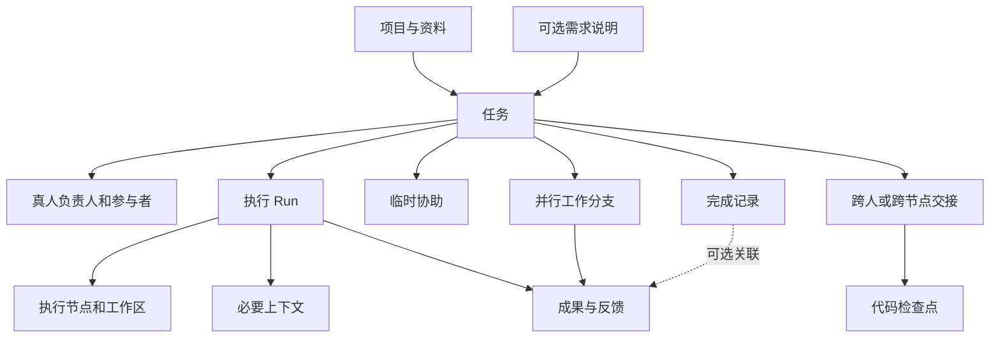
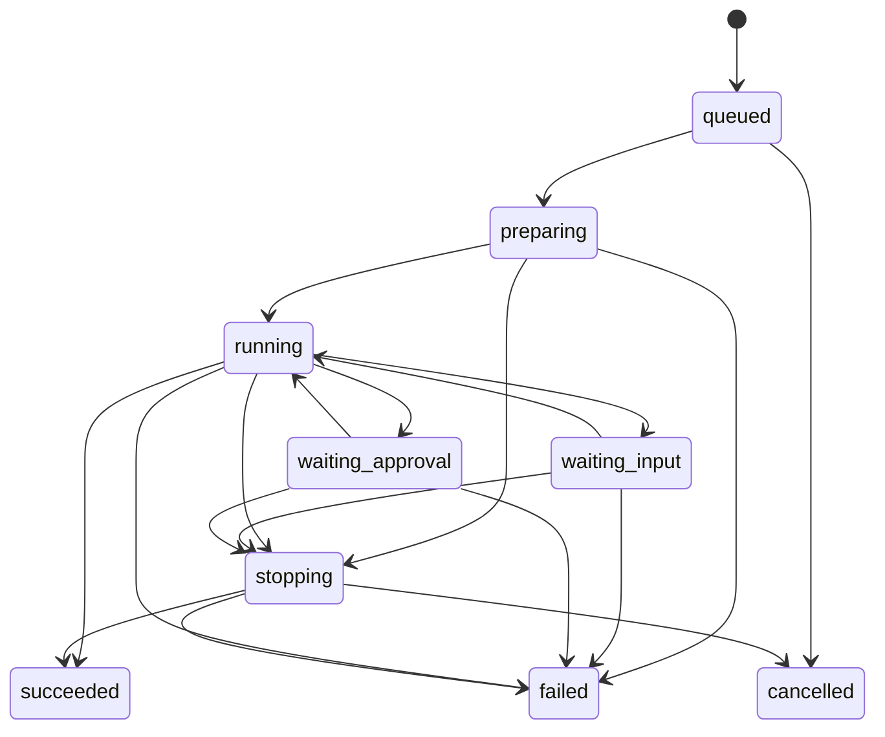

# 05｜领域模型与状态规则

> 规划基线 v1.1 · 2026-09-25 · 概念与行为约定，尚未实现。本文取代 v1.0 的强制证据验收模型。  
> [返回入口](../../README.md) · [功能规格](03-functional-specification.md) · [技术架构](06-technical-architecture.md)

## 1. 建模原则

**用户看到简单的工作流程，系统保留必要的事实区别。**

任务是持续存在的工作；Run 是一次受管执行；原生会话属于具体工具；工作区是代码与进程现场；成果是可查看、讨论和复用的产物。它们互相关联，但不能互相代替。

任务完成由团队决定，不要求 Evidence 或 Acceptance 对象，不要求测试报告、指定验收者或正式需求审批。结果是否合格、采用何种检查方式，由内部团队评估。

减少质量门槛不等于混淆执行事实：任务已完成不代表进程已经停止，也不代表代码已经发布。

## 2. 核心对象与最小边界

| 对象 | 主要内容 | 规则 |
| --- | --- | --- |
| Workspace / Membership | 工作空间、成员、角色、项目访问范围 | 私有与团队归属明确；账号存在不等于可见全部项目 |
| Project | 目标、成员、仓库、资料、约定、里程碑 | 可以先讨论后接代码；一个项目可关联多个仓库 |
| Requirement | 原始材料、可编辑说明、修订记录、相关任务 | 独立需求文档可选；没有正式需求也能创建任务 |
| Task | 标题、说明、归属、真人负责人、状态、参与者、依赖 | 创建时自动带入归属和负责人；不要求填写验收表 |
| AgentProfile | 工具、模型偏好、账号引用、执行配置 | 是可复用配置，不是替代真人责任的虚拟员工 |
| ExecutionNode | 归属、授权范围、系统、工具能力、连接状态 | 私人节点不因管理员角色自动变成共享节点 |
| WorkingCopy | 节点、仓库、分支、目录、基线、当前变更 | 同一受管现场默认只有一个活跃写入者 |
| Run | 任务、配置快照、输入、节点、原生会话、生命周期 | 再次执行或接力形成独立记录，不覆盖此前配置 |
| ContextBundle | 资料引用、约定版本、必要记录、摘要及排除项 | 系统按任务准备；用户可查看和调整，不强制手工配置 |
| CodeCheckpoint | 提交集合，或补丁与选定文件，及环境说明 | 用于恢复工作，不要求每次本机切换都推送提交 |
| Assistance | 请求者、参与者、问题、分享范围、目标版本、回应 | 协助不转移负责人或当前写入权 |
| WorkBranch | 同一任务下独立方案或子工作的输入、Run、工作区、结果 | 有代码写入的并行分支使用独立工作区 |
| Handoff | 来源与接手者、检查点、必要上下文、接手状态 | 主要用于跨人或跨节点接管；不套用于所有工具切换 |
| Agreement | 团队约定、来源、适用范围、版本、生效状态 | 有编辑权的人可从讨论直接保存，默认无多级审批 |
| Result / ResultRevision | 预览、代码差异、文件、说明、版本及来源 | 可以在任务完成前发布；后续修改生成新版本 |
| CompletionEvent | 完成或重新打开动作、操作者或规则、时间、可选结果引用 | 不依赖报告；保留是谁、以什么方式标记完成 |
| ActionAuthorization | 动作、资源、Run、有效期、授权来源 | 只解决实际执行授权，不用作业务质量审批 |
| ReleaseReference | 可选的发布版本、环境、链接与来源 | 人工记录与检测结果区分；不作为任务完成前提 |
| ActivityEvent | 来源、对象、时间、序号、关联与幂等键 | 用于状态、通知和追溯，不要求全量事件溯源 |

这些是概念边界，不要求每个对象成为独立服务、表单或菜单。分析、协助等无代码任务也可生成文字成果；不得因此强制创建 Git 工作区。

## 3. 对象关系

成果不要求先完成任务才能出现；完成也不要求先创建正式成果档案。一个事实只保留一个权威来源，管理视图与工作台使用同一组任务标识。

## 4. 任务状态

默认界面只有：**待处理 → 进行中 → 已完成**。取消与归档放在辅助操作中。

| 内部状态 | 中文 | 含义与来源 |
| --- | --- | --- |
| todo | 待处理 | 工作已记录，尚未开始；基本标题存在即可 |
| in_progress | 进行中 | 用户开始工作，或已授权的实际执行开始 |
| done | 已完成 | 有编辑权的成员按团队方式标记完成，或明确启用的自动规则触发 |
| cancelled | 已取消 | 不再继续这项工作，记录动作与可选原因 |

`waiting_feedback`、`blocked`、`paused` 作为独立的 attention 信息，带原因、需要谁回复、时间等。待反馈可显示成看板列，但不创建第二套任务状态；暂停工作不等于原生进程已暂停。已完成或取消后清除当前 attention，历史活动保留。

无需先写完整需求、验收项或测试报告才能进入进行中。私人任务负责人默认自己；项目任务默认创建者。允许待分配任务留在待处理，启动受管执行时自动由有权限的发起人承担责任，不能把 Agent 名称当作唯一负责人。

### 完成与重新打开

默认只有人能直接标记完成。项目可显式启用例如“指定 PR 合并后完成关联任务”的规则，并展示规则来源；这是流程配置，不是平台保证质量。AI 的“我做完了”和 Run 正常结束都不自动触发 done。

标记完成时有活动执行，界面显示“同时请求停止执行”（默认）与“仅标记任务完成”。后者仍保留醒目的活动执行提示。请求停止后，在收到终止确认前继续显示 stopping 或连接未知，不伪装立即停止。取消、归档同样不能隐去活动执行。

成员可直接重新打开已完成任务并继续，也可创建关联的后续任务。单纯新增评论、更新需求或出现新代码不自动撤销历史完成，不强制重新验收。用户在 done 任务中点击继续执行时，界面明确“重新打开并继续”，服务记录两项动作。脱离界面发起的执行请求也必须显式带重新打开意图，避免静默改状态。

## 5. 需求与约定的修订

Requirement 使用 `draft / active / archived` 表示整理中、在用与归档，不要求逐级确认。任务可以直接存在，不必绑定 Requirement。

人工保存产生修订历史；AI 的整理结果是可编辑草稿，用户可以局部采用。除非用户明确授予特定编辑能力，否则 AI 不能无声改写共享说明。重要范围变化提示相关人员，但不自动冻结全部工作。

Agreement 使用 `proposed / active / superseded / withdrawn`。从讨论“设为项目约定”时，有编辑权的成员在同一操作中选择范围并保存；这不是独立审批流程。不同约定冲突时提示处理，不仅按更新时间覆盖。

运行记录保存实际发送的约定版本。资料更新不代表已经进入正在运行的会话；界面可显示“上下文有更新”，由用户选择补充发送或下次继续时使用。

## 6. Run 生命周期与连接状态

执行生命周期：

`succeeded` 仅表示本次执行按适配协议正常结束；用户文案优先为“本次执行已结束”。拒绝某个动作后工具可能继续其他工作，拒绝和未完成部分必须保留。

连接观测另记 `fresh / stale / unknown`、`lastConfirmedState` 和 `lastConfirmedAt`。节点失联不直接证明进程失败或停止。终态由可信事件或核对结果决定，迟到日志不得反转新状态。

请求停止与自然完成有竞态时按实际确认结果记录；停止请求不覆盖已经确认的自然完成。重试创建新 Run，关联原 Run；继续同一个原生会话也创建新的受管执行记录。模型配置发生变化保留配置边界，即使原生工具允许在同一会话继续，也不能回写历史。

## 7. 三种协作动作的规则

### 继续

同机、同工作区、原写入已结束且权限不变时，系统自动准备当前变更和必要上下文，选择工具后即可开始；不强制推送提交、导出文件或接受交接包。新 Run 用 `previousRunId` 保留接续关系。

只有跨节点恢复、写入未结束、材料缺失、授权范围改变等具体情况才进入处理界面。原生会话能恢复时使用其有效引用；不能恢复时创建新会话，不宣称模型内部状态无损迁移。

### 协助

Assistance 状态为 `open / responded / closed / cancelled`。默认向指定人或 AI 分享所选材料，附目标版本；回应以讨论或 Result 返回。请求者、任务负责人和现有写入者保持不变。

建议型 AI 协助默认只读或在隔离副本运行。需要直接改代码时，显式转为并行分支或接手，不能因为被邀请就获得活动工作区写入权。源代码后续变化时提醒回应对应旧版本，但不触发任务验收制度。

### 并行

WorkBranch 记录共同起点、独立目标、执行者和结果；对代码的独立写入使用不同 WorkingCopy。用户可以比较、选择一个继续，或选择性整合多个结果。

分支状态为 `planned / active / ready / selected / discarded`；ready 表示有结果可看，不表示质量合格。每次执行状态仍由 Run 表达。选中方案不会自动取消其他进程，也不会自动合并主分支；界面提供分别处理的操作。

## 8. 跨人、跨节点交接

Handoff 状态：`preparing → offered → accepted`，另有 `rejected / withdrawn / expired`。用户主要看到“准备中、待接手、已接手”。

系统自动收集检查点、上下文、未包含文件及环境说明。跨节点检查点可以是可访问提交，也可以是经选择的补丁与文件，不默认包含密钥。接手方点击接手时自动检查访问和现场；仅对缺失项展开处理。

只有接收者有权限、代码可恢复、接管现场不存在未解决的旧写入时才能接受。无需另外审批代码质量。改变操作者不默认改变负责人；需要一起转移时，在同一界面明确选择并由接收者接受。

转交后尚未启动 Run，显示“已接手，尚未开始”。只有完成工作说明而缺代码时不得显示开发现场已恢复。普通任务改派没有迁移进程、账号或本地目录的副作用。

## 9. 写入控制与动作授权

同一受管 WorkingCopy 只有一个活跃写入持有者。租约或执行代次只能约束受管动作；服务端租约过期不等于旧进程已经停止。旧写入无法确认时，不直接授予同现场新的写入权，可另建隔离副本。

外部 IDE 和手工终端未必受平台约束。记录可识别的外部变化，不伪造修改者归属，也不声称拥有全局互斥。

ActionAuthorization 绑定主体、Task、Run、节点、动作、资源范围、有效期和策略版本；一次性批准不能重放到新动作。可预设有限范围策略以减少重复询问，超出范围时再请求授权。过期、拒绝、撤销和已消耗的授权不生效。

任务完成、协助邀请、分享链接、其他 Agent 的消息均不授予额外权限。底层拒绝必须真实生效，不能只是网页按钮变色。

## 10. 成果、完成与发布

Result 可以是说明、文件、预览、diff、接口样例或外部链接，关联来源任务及可取得的代码版本。ResultRevision 保留历史，不要求收集统一验证证据。可选检查附件记录来源和版本，旧结果不能冒充新代码的检查结果，但不阻止成员标记任务完成。

CompletionEvent 保存操作者或自动规则、时间、当时任务修订及可选成果引用。完成说明可以自动生成并由用户修改，不是必填报告。质量评估由团队掌握，不建设默认 Acceptance 状态机。

ReleaseReference 按需要关联发布位置与结果。真正触发部署时沿用执行授权、去重和状态核对；标记任务完成不会部署，PR 合并也不等于已上线。

## 11. 数据一致性与保留

派发、接手、完成和重新打开使用版本比较及幂等键，防止重复点击、并发更新和旧事件覆盖。原生事件保留来源、序号和接收时间；数据库更新与待发送事件需要一致的持久化边界。

外部操作无法仅靠本地数据库保证恰好一次；超时后核对实际结果，不盲目再次发布或写入。

上下文发送、搜索、通知和成果分享均按权限过滤。失去访问权后阻止后续发送，不承诺能收回已经提供给外部模型的内容。归档优先，永久删除受权限控制；保留期限由团队设置。公开源码仓库不保存真实内部评估、凭证或客户资料。

## 12. 与 v1.0 的关系

本仓库尚无运行数据库，本节是设计变更而非已执行的数据迁移。v1.0 的 `ready / in_review / accepted` 不再作为默认任务主状态；原强制 Evidence、Acceptance 和有效验收统计不进入 v1.1 核心模型。底层运行状态、访问控制、写入边界和历史记录继续保留。

业务状态以本文为准；不得从旧版本测试矩阵重新引入已经移出的质量门槛。
