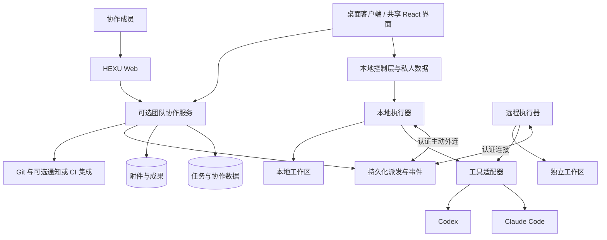

# 06｜技术架构与执行边界

> 产品基线 v1.1 · 客户端形态更新于 2026-09-26。本文描述目标架构；实际范围见 [实现进度](../development/21-implementation-status.md)。
> [返回入口](../../README.md) · [领域与状态](05-domain-and-state.md) · [技术依据](08-decisions-risks-and-sources.md)

## 1. 技术服务于产品

HEXU 自主掌握任务、继续、协助、并行、上下文、成果与整体体验。原生工具负责自己的 Agent 执行能力，Git 负责代码版本，成熟组件负责基础设施。

本轮移除核心领域对质量证据和正式验收状态机的依赖。任务完成不查询测试报告，也不要求 Acceptance 服务。检查、CI 与内部评估可以作为附件或集成存在，不驱动默认业务门槛。

认证、权限、正确停止、避免覆盖和故障恢复继续保留。这些是产品正常工作所需的基础，不是额外的业务验证制度。

## 2. 总体结构

产品形态按 [ADR-0008](../engineering/adr-0008-client-surfaces.md) 确定为桌面优先、可选团队服务与 Web 协作入口。个人工作不依赖团队服务器，团队服务和 Web 可部署于允许的云资源或自管机器，不以成熟内网、VPN、统一身份、Kubernetes 或现成需求系统为前提。对外访问需要 HTTPS 与用户身份验证，公网访问不等于公开任务数据。当前应用仍只允许回环连接，桌面打包和跨电脑部署未完成。

执行器主动连接服务，不要求开发者公开原生控制端口。浏览器不直接获得节点的任意命令权。

## 3. 推荐实现边界

| 层 | 主要责任 |
| --- | --- |
| 桌面／Web 共享界面 | 共用项目、任务、协作和成果模型；桌面侧重本机编程，Web 提供查看、讨论、反馈与获授权操作 |
| 桌面宿主 | 安装启动、本地入口、窗口与系统集成；不把数据库、凭证和任意进程能力暴露给渲染层 |
| 协作服务 | 用户、任务状态、参与关系、资料、接手、成果、权限与通知 |
| 派发与事件 | 持久化执行请求、去重、状态归一化、连接恢复 |
| 执行器 | 节点能力、工作区、工具进程、授权转发、事件缓冲 |
| 工具适配器 | 原生输入输出、状态、恢复、取消、模型配置与错误映射 |
| 存储与集成 | 文件、版本化材料、Git 引用、外部结果和可选检查记录 |

保留模块化单体控制服务、独立执行器、共享前端与关系型数据库；无需初始引入复杂微服务或全量事件溯源。持久化派发通过业务表与可靠后台任务实现。窗口、控制服务和 Runner 生命周期分别处理，不能将关闭窗口当成停止确认。

当前采用 React/Vite、TypeScript、Fastify、Node 24、npm 与分模式 SQLite，以仓库锁文件和运行说明为准。正式 PostgreSQL 尚未交付。Electron／Tauri 尚未选定；增加桌面宿主不要求重写既有 Node Runner 或业务领域，也不代表 Windows 原生执行已可用。

建议代码边界为 web、control、runner、contracts、adapters、ui。即使共用语言，也需要运行时协议校验和版本兼容，不只依赖编译期类型。

## 4. 单一任务模型

桌面、Web、管理概览、AI 执行与成果使用同一 Task 模型与作用域内的标识。私人任务不自动公开给团队；不能再建立一个“AI 工作区任务库”与团队任务同步。

Task、Run、Native Session、WorkingCopy 各有边界，详见 05。对用户的界面简单，不意味着后台把它们压成一个 status 字段。

默认完成是成员或已配置规则的操作事件，与代码质量判断解耦。保留来源、时间和可选成果引用，不要求验证覆盖率。检查结果作为 Result 附件保留版本，不成为必须调用的完成服务。

现有数据库和迁移必须保留原 ID、历史与模式隔离；设计决定不授权重建或导入用户数据。不要为兼容未实现的 v1.0 再建设一套旧验收模型。

## 5. 原生工具接入

### Claude Code

官方提供程序化 CLI 与结构化输出；Agent SDK 提供会话、工具和权限等接入能力，可作为集成基础。[S01、S02](08-decisions-risks-and-sources.md)

选择 CLI 或 SDK 时，需要匹配输入、原生恢复、运行中补充、授权、停止和结果获取等实际能力。不要依赖截取终端显示文本来替代稳定事件，也不因为安装某个回调就假设控制了全部原生操作；实际权限模式和规则仍需匹配。[S03](08-decisions-risks-and-sources.md)

### Codex

App Server 提供线程、执行事件和授权交互，适合通过执行器接入。部分能力有实验性标记，产品应按适配器实际支持显示，而非承诺全部可用。[S04](08-decisions-risks-and-sources.md)

原生 thread／turn 与 HEXU Run 分别记录。拥有会话 ID 不等于能在另一个节点或账户恢复。原生控制服务不直接暴露到公网。

### 统一能力声明

| 概念能力 | 产品使用方式 |
| --- | --- |
| discover | 发现工具版本、模型配置和可用能力 |
| start | 在指定工作区与授权范围内开始执行 |
| send_input | 补充问题或要求，说明即时输入或下一轮生效 |
| resolve_authorization | 将响应送达正确原生授权请求 |
| stop | 发出停止请求，再等待实际结果 |
| resume | 明确原生继续还是基于上下文新建会话 |
| collect_result | 归集变更、输出、错误与可用的用量信息 |

方法名为概念协议，不是声称原生工具存在同名 API。能力值区分 supported、partial、unsupported、unverified。不能伪造原生工具不具备的实时输入、暂停或跨账号恢复。

账号授权独立处理。SDK 认证与本地 CLI 登录不能被等同为可共享订阅；具体使用方式按官方说明核对。HEXU 不设计个人订阅共享池，账号以受控引用使用，不把凭证放入公开仓库。[S02](08-decisions-risks-and-sources.md)

## 6. 继续、协助、并行的技术实现

### 继续

同机原写入已结束时，复用合适的 WorkingCopy，快照记录现有变更、任务上下文和配置，创建关联原 Run 的新执行。不要求每次推送提交或创建正式 Handoff。

跨工具不迁移隐藏状态，而使用代码现场与可观察工作记录。换节点时才需要可传输检查点和环境说明。自动准备不执行额外未授权的上传或付费切换。

### 协助

建立 Assistance，附选中材料与来源版本。给真人发送可访问的任务入口；给 AI 创建限定上下文的 Run。默认只读或隔离副本，不共享主执行的写入租约。

协助结果回写相关线程或 Result。采用建议是独立动作；需要写入时明确转换为工作分支或接手。原任务负责人不自动改变。

### 并行

每条 WorkBranch 保存目标、共同检查点、执行配置和结果。修改代码的分支用独立工作区；非写入分析可使用受保护的固定材料。

Git worktree 可作为多个工作目录的实现基础，但不构成完整安全沙箱。[S05](08-decisions-risks-and-sources.md) 数据库、端口、缓存、凭证和外部服务资源仍需分别安排。

比较与选择使用成果和代码引用；整合通过明确的 Git 操作及权限执行。选择某条方案不自动合并全部变更，也不静默停止其他分支。

## 7. 上下文与共享约定

按项目资料、团队约定、当前工作记录准备 ContextBundle。记录可访问引用、实际发送版本、摘要与排除项，不每次将全部项目文本送给所有执行者。

共享资料修改后保留修订，并提示相关任务。正在执行的上下文不会因数据库变化自动更新；支持补充时发送，不支持时显示下次生效。普通资料更新不强制暂停全部运行。

用户可编辑 AI 计划和总结。AI 草稿与用户保存的共享说明分开；有权限的成员可直接从讨论保存项目约定，不引入独立审批子系统。

检索、摘要和分享都按权限过滤。被撤销的引用不得继续读取或发送，但不能承诺收回已经发给外部模型的信息。

## 8. 本地、远程与跨环境

个人节点默认只由获授权的人使用。节点归属、工具账号、任务访问范围和操作系统权限独立，不因用户是团队管理员就共享本机全部文件。

远程节点可以使用专用用户、虚拟机或配置合适的容器。普通开发任务不挂载完整主目录、生产凭证或宿主容器控制套接字。隔离强度按实际配置确定，不宣称“用了容器就安全”。

跨环境交接依赖可访问提交，或选定的补丁与必要文件；检查未追踪文件与秘密，明确哪些内容没有包含。后台服务、数据库内容和进程内存不承诺自动迁移。

对分析与讨论类工作允许无代码工作区；对实际代码写入，必须有权限范围内的目录或仓库。团队开始讨论不依赖所有开发环境同时准备完成。

## 9. 权限与真实执行

通过有限范围的预设策略减少重复询问：正常编辑可在已授权范围内连续执行，新的外部访问、破坏性动作或权限扩大再请求同意。

动作授权绑定 Run、资源、动作、有效期及策略；拒绝、过期和撤销实际阻止对应操作。内容中的请求、共享链接、成员评论和 Agent 消息不产生新的执行权限。

同一受管工作区默认单写入。租约过期不能证明原进程停止；旧写入未确认结束时，不在原现场发起第二个写入。外部 IDE 不一定受平台租约约束，发现变化时如实记录。

服务器对每次访问与操作校验权限，不只依赖前端按钮。预览代码属于不可信内容，使用独立来源或等效隔离与短期访问凭证，不泄露主站会话。

## 10. 数据与隐私

| 数据 | 默认处理方向 |
| --- | --- |
| 任务、讨论、约定与完成记录 | 按工作空间和项目权限保存 |
| 完整本地仓库与私人草稿 | 不因连接节点自动上传 |
| 网页使用的 diff、文件与成果 | 明确范围后同步，受大小、权限和保留策略控制 |
| 原生日志 | 按需同步与脱敏，默认展示关键事件 |
| 模型请求 | 核对提供方、接收范围、资料权限与所选配置 |
| 密钥 | 本地系统凭证存储或受控密钥服务，仅保存引用 |
| 内部评估与生产数据 | 不提交到公开产品源码仓库 |

自托管不等于模型请求不离开组织，本地代码不等于日志没有代码。接入向导与设置解释真实数据流。

## 11. 恢复、维护与成本

执行请求持久化并带幂等键，重连不重复创建进程。事件包含来源、顺序与时间，终态核对实际运行。超时的部署或外部写入先核对结果，不笼统重试。

Task 完成和 Run 停止分别保存。用户请求同时停止时，只记录已发出请求，确认前继续展示 stopping 或连接未知。

平台故障时允许用户继续使用本地代码与原生工具；恢复后识别变化。备份覆盖数据库与成果引用，归档、导出和保留策略可配置。

费用可能是估算、部分值或累计值，记录来源、区间和恢复基线，避免重复累计；预算只能限制平台可控范围，不能保证已发请求零超额。[S01](08-decisions-risks-and-sources.md)

工具、适配器与节点协议版本有兼容范围。诊断提供可定位错误，不把故障记录转为员工评价。

## 12. 自研与复用取舍

优先复用文本编辑、diff、终端、Git、数据库和基础身份组件，自研任务协作与上下文行为。第三方完整平台是研究参考，不自动成为依赖；复用前核对许可证和维护成本。

本文件不再规定产品验证矩阵、样本数量或阶段评审制度。内部质量、性能、安全和上线评估由团队安排；具体技术结果未产生前，不将建议写成已经实现的能力。
