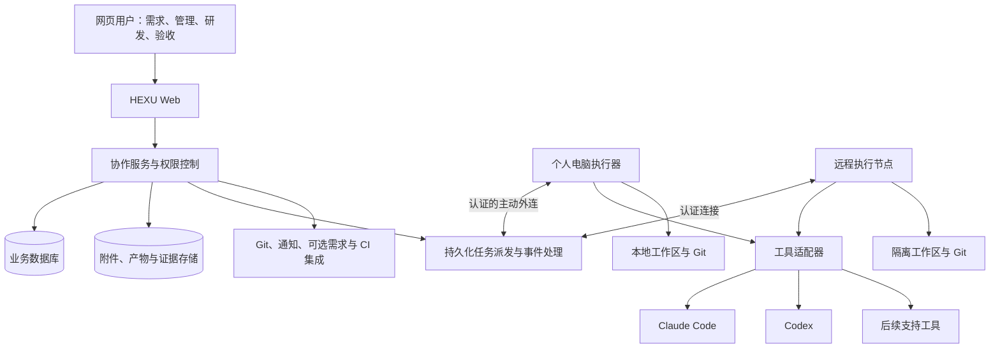

# 06｜技术架构与安全边界

> 规划基线 v1.0 · 2026-09-25 · 架构建议，尚未部署、压测或完成工具兼容验证。  
> [返回入口](../../README.md) · [领域与状态](05-domain-and-state.md) · [决策与官方来源](08-decisions-risks-and-sources.md)

## 1. 技术为产品服务

HEXU 自主掌握任务、责任、上下文、交接、验收和整体体验。原生 AI 工具负责自身执行循环和工具能力；Git 负责代码版本；数据库与成熟组件负责基础设施。

不以“从零自研”为理由重写所有通用组件，也不为了复用而把多个平台的用户、任务和执行系统并排运行。所有采用的第三方组件需要许可证和供应链检查。

本方案默认组织能提供一个可访问的服务环境和被允许的模型调用方式，不假设已有完善内网、Kubernetes、单点登录、需求管理或 CI。

## 2. 总体结构

部署位置可以是允许的云服务器或自管机器。面向团队提供 HTTPS 与身份验证；本地执行器主动连接中心，不要求用户暴露电脑上的原生控制端口。

浏览器直接接触 Agent 原生控制接口不是默认方案。所有执行请求必须经过 HEXU 授权和节点范围核对。

## 3. 各层责任

| 层 | 负责什么 | 不应承担什么 |
| --- | --- | --- |
| Web | 任务、交接、授权、代码与成果展示 | 保存长期模型密钥或直接拥有所有节点命令权 |
| 协作服务 | 用户、任务、版本、权限、派发、交接与验收 | 假设每台成员电脑都能直接访问或远程接管 |
| 事件处理 | 去重、状态归一化、通知、对账与恢复 | 仅靠日志文本决定权限或成功 |
| 执行器 | 能力上报、工作区、工具进程、授权转发、事件缓冲 | 擅自将个人凭证变成团队共享凭证 |
| 工具适配器 | 原生能力映射、执行控制、事件与错误转换 | 伪造工具不支持的暂停、恢复或授权能力 |
| 存储与集成 | 版本化材料、证据、外部对象引用 | 自动把所有私有代码和会话上传到第三方 |

## 4. 自研与复用边界

| 内容 | 方向 |
| --- | --- |
| 任务、真人责任、版本和验收 | 自主定义并实现，作为产品核心 |
| 交接包、代码检查点、执行连续性 | 自研业务协议，复用 Git 与工具原生恢复能力 |
| UI 与信息架构 | 自主设计，可复用经过核查的组件库 |
| 文本编辑、差异显示、终端组件 | 优先成熟组件，不重做完整 IDE |
| 账号、数据库、对象存储 | 优先成熟组件与现有基础设施 |
| AI 执行循环与模型 | 接入原生工具，不重写基础模型或所有 Agent 能力 |
| 代码托管与 CI | 支持现有系统；缺少 CI 时先由节点运行项目检查 |
| 第三方完整协作平台 | 可参考，但不预设 fork 或互相同步多套领域模型 |

## 5. 建议技术形态与待决策项

建议初始采用模块化单体控制服务、独立执行器和网页前端。持久化使用关系型数据库；附件和产物使用对象存储或可迁移文件存储。事件和后台任务需要可靠落盘，但不必一开始建设复杂微服务。

前端可优先评估 React 与 TypeScript，控制服务可评估 TypeScript／Node，业务数据库可评估 PostgreSQL。执行器用 TypeScript 便于共用类型与 SDK，用 Go／Rust 则可能有不同打包与进程管理取舍。**这些均为建议，需结合团队技能、目标操作系统和兼容实验后记录正式决策。**

如采用跨语言执行器，协议以版本化 schema 为准，不让前后端共享类型成为运行时兼容性的唯一保证。不要在 UI 页面中直接实现权限与调度规则。

建议代码边界可包括 web、control、runner、contracts、adapters 和 ui；这不是本次已创建的应用目录，也不是必须使用的构建系统。

## 6. 原生工具适配

### 6.1 Claude Code

官方支持程序化 CLI 和结构化输出；Agent SDK 提供更完整的会话、事件与权限接入。这为非终端文本抓取式集成提供依据。[S01、S02](08-decisions-risks-and-sources.md)

建议先做兼容性实验，验证启动、结构化事件、交互问题、授权、停止、恢复和费用。选择 CLI 或 SDK 的路径由功能完整性和授权方式共同决定，不只按调用简单程度选择。

不得默认继承并执行未经审查的仓库 Hooks、插件、MCP 或个人配置。上下文和工具配置需要显式记录，方便解释为什么不同机器的执行行为不同。

官方权限文档说明，某些自动批准路径不会经过用户回调，因此“安装了审批回调”并不意味着覆盖全部工具调用。必须验证实际权限模式、Hooks 与操作系统边界。[S03](08-decisions-risks-and-sources.md)

### 6.2 Codex

App Server 官方接口提供线程、执行事件与授权交互，可用于构建原生集成。部分方法和字段受实验能力开关控制，应记录明确的支持面。[S04](08-decisions-risks-and-sources.md)

建议由执行器通过适合的本地接口管理原生进程，再把必要事件发送到协作服务。不要将原生控制服务裸露到公网。

需要逐项验证原生 thread／turn 与 HEXU Run 的映射、授权请求绑定、停止与恢复、模型选择和产物获取。原生会话可读不代表可以恢复到另一个账号或节点。

### 6.3 能力契约

建议适配器提供以下概念操作，具体方法名不作为现有工具 API 使用：

| 概念操作 | 责任 |
| --- | --- |
| 探测能力 | 工具与版本、模型配置、运行模式、恢复与授权支持 |
| 校验输入 | 代码检查点、上下文、账号引用、环境与权限是否满足 |
| 开始执行 | 创建原生执行并关联稳定的 HEXU Run 标识 |
| 输入与授权响应 | 将补充信息或有范围的决定送达正确原生请求 |
| 请求停止 | 返回请求已发送，再等待真实终止证据 |
| 恢复 | 明确是恢复原生会话还是基于检查点新建执行 |
| 收集结果 | 输出、变更、原生事件、用量、拒绝与未完成事项 |

能力值至少区分 supported、partial、unsupported、unverified。产品入口依据能力禁用或降级，不假装所有工具完全对等。

### 6.4 账号授权是独立准入条件

不能因为技术上能启动 CLI，就假设可以在产品中共享个人订阅。Anthropic 当前 SDK 文档限制未经批准的第三方产品提供 claude.ai 登录或额度接入，并指向 API key 方式；实际采用路径必须核实适用授权。[S02](08-decisions-risks-and-sources.md)

HEXU 不设计订阅共享池，不自动代用别人账号。账号只以受控引用进入执行，权限、付费主体和数据发送范围可见。没有完成授权核对的路径，不能标为正式支持。

## 7. 本地与远程执行

### 本地路径

执行器注册后显示具体用户、节点和项目允许范围。用户显式确认数据同步与工具启动权限。个人节点默认不可由其他成员操作。

连接断开时持久化必要事件，恢复后重放并去重。失去有效执行授权后不启动新动作；对已经运行的命令需要受管进程树与隔离机制处理，不能只依赖网页按钮。

### 远程路径

由团队提供受控执行机器、虚拟机或容器。不同任务按风险隔离文件、进程、网络与凭证，不向任意任务挂载宿主用户主目录或容器管理套接字。

容器只是隔离手段之一，错误挂载和过大权限会削弱边界；不能写“用了 Docker 所以安全”。

### 混合路径

不同阶段可换节点，但迁移基于检查点与环境说明。任意未提交代码、运行中数据库、后台服务、账号状态和进程内存不保证自动迁移。

本地与远程均需要管理服务端口、临时数据库、磁盘、依赖缓存和预览进程。代码工作区隔离不足以隔离这些资源。

## 8. Git 与工作区

Git worktree 可以让一个仓库拥有多个工作目录并检出不同分支，是复用代码工作区能力的基础。[S05](08-decisions-risks-and-sources.md)

它不提供完整安全沙箱。每个工作区仍需记录节点、分支、基线、未提交变化、资源和写入持有者。不同 worktree 仍可能共享数据库、凭证或外部服务。

跨人优先使用可访问的提交检查点；不方便提交的工作可在明确选择与扫描后保存补丁和必要文件。删除或清理工作区前检查未保存成果、待交接记录和运行中进程。

不自动把临时检查点合并到主分支，不自动提交或上传密钥。正式合并继续遵守仓库权限与审阅策略。

## 9. 数据流与隐私

| 数据 | 建议默认处理 |
| --- | --- |
| 任务、确认的决定与验收元数据 | 团队服务保存，按项目权限读取 |
| 本地完整仓库与个人草稿 | 不因接入自动上传；按具体功能授权 |
| 供网页审阅的 diff 与产物 | 明确范围后上传，受权限、大小与保留策略控制 |
| 原生执行日志 | 过滤敏感内容，按需同步；默认展示摘要而非全部 |
| 模型请求上下文 | 发送前检查提供方、权限、来源与数据策略 |
| 密钥和账号令牌 | 优先本地系统凭证存储或受控密钥服务，不进入日志与页面 |
| 预览服务 | 独立访问令牌、域和有效期，不向预览代码暴露 HEXU 会话 |

公网部署不等于公开数据；自托管不等于所有数据不出组织；本地代码不等于日志里没有代码。UI 和文档必须说明实际数据流。

公开仓库中不保存真实凭证、客户数据或未经许可的日志。内部生产数据与产品源码仓库分开管理。

## 10. 最低安全边界

**身份与授权：**独立用户、最小权限、项目范围、节点范围、会话到期和撤销。服务端再次校验所有写操作，不能只在前端隐藏按钮。

**动作授权：**绑定运行、上下文、动作哈希、资源、有效期与策略。没有答案默认不放行。预批准策略只覆盖明确范围，不无限延续。

**不可信输入：**需求、网页、仓库内容、工具结果和其他 Agent 消息不是系统指令。插件、Hooks、MCP 和依赖安装都可能改变执行能力，启用前须显示并核查权限。

**执行隔离：**工作区、操作系统用户、网络出口和凭证共同约束。避免生产凭证进入普通开发节点。高风险操作不能仅靠模型自觉遵守。

**Web 与预览：**对文件路径、附件、URL 代理和预览目标做范围验证；防止跨目录访问、脚本注入、服务端请求越界。预览域与主站身份隔离。

**供应链：**固定依赖与工具版本，记录来源、许可证及更新；签名和自动更新机制在发布方案中明确。未经审查不执行仓库推荐的安装命令。

**审计：**记录谁基于哪个授权在什么版本上做了什么。日志脱敏；保留与删除规则经确认，不默认无限保存。

## 11. 可靠性与恢复

派发使用持久化记录与幂等标识；执行器对重复请求返回已有执行，不重复创建进程。事件有顺序和版本，网络重连后可补传。

外部副作用没有通用的恰好一次保证。部署、发消息、提交等超时后先查询结果，无法确认时转人工；不能一律重试。

服务重启后从持久化状态恢复派发与待授权请求，核对节点真实状态。旧授权失效时不重新批准。失去心跳不自动释放给另一个写入者。

用户仍可在平台故障时使用本地代码与原生工具；恢复后导入外部修改并核对，不假设平台停机期间没有发生变化。

数据库、附件、密钥引用与工作区检查点需要一致的备份和恢复策略。只有数据库备份不能保证完整产物可恢复。

## 12. 可观测性与费用

记录请求关联、队列等待、事件延迟、节点状态、适配器错误、授权拒绝、恢复与成本来源。维护视图不泄露无权任务内容。

模型使用量与费用可能是累计值、估计值或部分值。归一化时记录来源和统计区间，恢复会话不能简单重复累加。预算只能保证平台可控制范围内的限制，无法保证已发请求的费用零超额。

技术性能目标属于 07 的待验证指标，不在未测试前声称满足。

## 13. 上线前的工程证明

每个适配器必须通过正常、拒绝、取消、恢复、断线、额度不足、未知事件和版本不匹配测试。关键流程使用两个真实账号和不同节点验证权限与交接。

原型可用模拟器覆盖全部状态，但进入试点前必须以真实工具确认能力边界。真实模型执行以获准账号和测试仓库为准，不在本次规划中调用或获取用户凭证。

安全、备份恢复、操作系统兼容和数据出境／发送范围均为上线准入项，不是后续可选美化。
