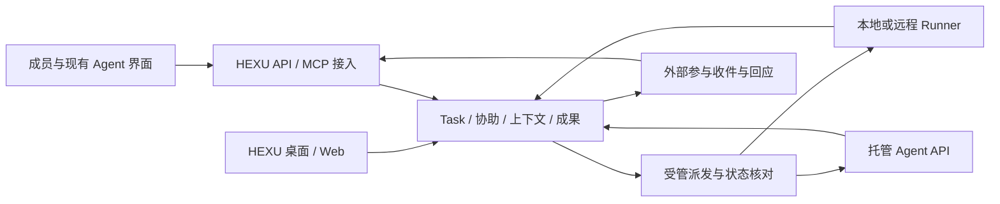

# 10｜跨 Agent 协作与云端接入规划

> 下一阶段增量规划 · 2026-10-08 · 本文描述目标，新增能力尚未实施。
> [产品目录](README.md) · [现有行为基线](03-functional-specification.md) · [领域与状态](05-domain-and-state.md) · [当前能力](../development/21-implementation-status.md) · [下一项](../development/22-next-delivery.md)

本规划承接“打通个人与团队各自的本地、云端 Agent，充分发挥各自能力”的产品方向。本轮对比完整框架提案后收敛：首个产品交付改为真实跨成员 Agent 协作，本地材料取件/回填只是工程步骤。本文负责增量目标、协作方式和接入取舍；工程拆分见 [开发 25](../development/25-agent-collaboration-delivery.md)。现有 Task、Run、Operation、权限和完成语义继续有效。文中的新对象、工具名和交互是设计，不是现有 API。具体下一项只在 22 维护，原工作项状态只在 19 维护。

## 1. 产品定位与核心取舍

**HEXU 是连接人与独立 Agent 的开放协作框架与工作台，让不同成员的本地与云端 Agent 保留各自能力，围绕共同工作发现协作者、协商、互助、接力并交付成果。**

品牌与标语延续“HEXU · 合序——让人和 AI，一起交付”。产品首先服务软件产品研发，包括需求澄清、调研、设计、编码、修复、文档和发布准备。

用户可以在 HEXU 发起工作，也可以继续在熟悉的 Agent 产品里工作。HEXU 提供共同的任务、协作动作、已确认事实和成果入口；执行方保留自己的推理、工具、会话与特色体验。

框架层面向 Agent 和接入开发者，工作台面向人，两者使用同一套领域与权限。研发是首要落地场景，研究、设计与文件协作不必先绑定 Git。“开放”指可集成、可替换和可导出，不代替仓库所有者决定许可证或运营方式。

本轮明确五项取舍：

1. **协作是主线。** 云端持续执行、远程节点和后台职责服务于这条主线。
2. **双向接入。** 既支持 HEXU 委托可调用的 Agent，也支持现有 Agent 主动读取获授权材料、请求协助和交回成果。
3. **先证明独立 Agent 的协作。** 第一轮包含跨成员、真实远端、澄清和结果消费；然后验证一项原生特色能力，再扩展代码接力与长期调度。
4. **授权范围内连续协作。** 用户可保存常用协作范围；Agent 在范围内找助手、交换材料和继续推进，无需每条消息再确认。
5. **每个阶段都交付完整体验。** 连接、取件、回应、查看、继续和撤销一起设计；支持品牌数不作为首要目标。

保留个人与团队双场景、一个 Task 工作区、轻管理与成果导向。现阶段投入集中在研发协作，不建设虚拟员工层级、通用办公套件、Agent 商店或通用流程绘图器。

## 2. 目标体验

### 一条完整旅程

用户在本地 Agent A 中推进“订单导出”。A 发现接口含义不清，在已有授权内向同事开放的 Agent B 发起有限协助。B 取得对应版本的接口约定和问题，返回解释；有争议的业务决定交给相应成员，已确认结论保存为项目约定。

实现任务需要浏览器检查时，A 可把一个有边界的分支交给具备该能力的云端 Agent C。C 在独立环境完成修改，提交代码版本、检查说明和预览。用户在原 Task 查看各项成果，选择继续或整合，同事直接在具体成果版本上反馈。

成员可以从任何已接入入口了解进展。需要接手时带走必要上下文和可恢复代码；每个 Agent 的私人历史与账户仍由其所有者控制。整个过程属于同一项工作，不要求用户在聊天之间手工搬运每一轮问答。

### 优先覆盖的五种协作

| 场景 | 用户动作 | HEXU 应交付的结果 |
| --- | --- | --- |
| 一个人使用多个 Agent | 让另一个 Agent 分析一段报错或方案 | 固定材料、可追问的回应与来源，回到原 Task |
| 不同成员的 Agent 协作 | 请同事允许参与的 Agent 回答接口问题 | 无需分享全部项目或账户，能看清谁代表谁、何时需真人回复 |
| 本地与云端接力 | 把一个明确部分交出去，之后接回 | 输入版本明确，远端结果可取回，本地可从独立副本继续 |
| 多 Agent 分工或比较 | 分别实现独立部分，或比较同题方案 | 分工与替代方案分开表达，独立现场、依赖和成果可追踪 |
| 持续关注项目工作 | 按时间或事件整理反馈、准备修改 | 具体工作进入现有 Task，有负责人、去重、到期与停止方式 |

单 Agent 工作仍然顺畅。只有确有协作收益时才增加参与者，默认不把每次任务自动拆成多 Agent 流水线。

## 3. 接入什么，以及能控制到哪里

### 3.1 三种参与方式

| 方式 | 谁组织执行 | HEXU 能提供什么 | 必须如实显示什么 |
| --- | --- | --- | --- |
| 受管执行 | HEXU 通过原生适配器、远程 Runner 或托管 API 发起 | 派发、Run、进展、输入、停止与成果归集，按真实能力开放 | 已派发、已启动、等待输入、停止中、终态与未知分别记录 |
| 外部参与 | 用户已有的 Agent 产品或服务自行执行，通过 HEXU API/MCP 协作 | 有限材料、协助收发、成果提交、后续问题和可选状态回报 | 连接、取件、外部自报、服务确认是不同事实；没有控制接口时不可宣称已停止 |
| 手动关联 | 用户在未接入工具中工作 | 关联固定成果、来源链接与人工说明，保持后续可接入 | 来源为人工记录，无法自动追踪；不能作为完成接入的验收结果 |

同一提供方可支持多种方式。云端托管运行时与用户已有的个人 Agent 实例分别登记，不能因为同一品牌就混用权限、会话或费用。

### 3.2 最小连接与身份模型

在现有 `Connection`、`AgentProfile`、`ExternalReference` 概念上增加独立参与身份和能力入口。身份、如何连接、开放什么能力分别表达；实施时按实际需求落表，不新建一套任务库。

| 概念 | 保存什么 | 与现有模型的关系 |
| --- | --- | --- |
| Agent 参与身份 | 所有者、维护者、提供方/原生实例、可参与范围 | 同一人可有多个独立 Agent；不替代真人负责人，凭证轮换不改变身份 |
| 端点与连接 | 联系方式、认证引用、协议版本、接收/查询方式及连接状态 | 一个身份可关联不同端点；端点地址或在线不等于执行权 |
| 共享能力 | 具体工作目的、输入/输出、能力版本、开放范围、接收条件与容量 | 用户可开放“本项目接口解释”，无需共享整个个人 Agent |
| AgentProfile | 工具、模型偏好与执行配置 | 继续作为配置，不能兼任完整参与身份 |
| 本次参与关系 | Task 或有限 Assistance、连接、代表成员、允许动作、材料范围、有效期 | 附在已有协作对象上；不把 Agent 写成真人负责人 |
| 远端映射 | connection、remote session/task/turn/artifact ID 与本地对象关联 | 外部 Task 映射到本地 Run、Assistance 或 WorkBranch；不自动新建重复业务 Task |
| 来源记录 | 实际连接身份、代表成员、请求/回应关联、版本、时间与可选远端记录引用 | 认证证明连接来源；Agent 自报的模型、工具或“完成”仍注明来源 |

同一用户的 Agent A 和 B 可以相互协助。它们是不同参与身份，不需要创建两个虚构成员账号。普通 Task 的负责人、真人参与者和当前操作者规则延续。

### 3.3 能力声明

每项能力分别表达下列三维事实，并附提供方版本、适用环境与最近验证依据；不能合并成一个“支持”标签。

| 维度 | 取值含义 |
| --- | --- |
| 提供方能力 | 支持、受限、不支持、未验证 |
| HEXU 接入 | 可调用、部分适配、仅原生入口、尚未接入 |
| 本次可用性 | 已授权可用、待授权、账户受限、环境不可用或未知 |

共同层统一身份、工作关联、请求/回应、材料与成果；可选层保留原生交互差异；提供方扩展带版本、输入输出、授权类别和回退方式。首轮只验证必要能力，不先复制全部原生界面。

| 能力组 | 需要表达的差异 |
| --- | --- |
| 工作输入 | 文本、文件、代码基线、图片，以及各自大小/格式限制 |
| 接单方式 | 用户主动取件、定时取件、可主动唤醒；支持 MCP 不自动代表支持后台唤醒 |
| 过程交互 | 状态查询、事件、提问、即时补充或仅下一轮输入 |
| 执行控制 | 启动、取消请求、终态确认、会话继续、原生界面入口 |
| 产物 | 文字、完整代码对象或补丁、文件、预览、外部链接及保留期限 |
| 特色能力 | 浏览器、专用工具、技能、内部子 Agent、长时任务；按需要展示原生入口 |
| 资源限制 | 并发、时长、费用来源、可硬执行的限制与仅提示的预算 |

建议工具选择按“可完成本次动作 → 当前有权限且可用 → 用户常用配置 → 已知成本”排序。第一版由人选择或使用已保存的默认助手；后续在允许的候选内自动路由，不预设永久模型排名。

## 4. Agent 之间怎样协作

### 4.1 请求、回应与接续

统一请求至少包含目标、材料版本、预期产物、接收者、授权引用和对应 Task/Assistance/WorkBranch。多数信息由当前任务自动带入，不让用户填写协议表。

流程为：

1. 发起者从当前工作提出明确问题，系统核对其当前权限、接收连接和可分享材料。
2. 请求与待投递事件原子保存，返回可查询的业务记录；相同请求重试确认原结果。
3. 接收 Agent 按支持的方式取件或被唤醒，可以接受、拒绝、要求澄清或提出范围调整。已取件仅表示材料已读取；接受表示承担工作，实际受管启动才产生运行事实。
4. 回应绑定请求与输入版本；提问返回原请求线程。发起 Agent 可在既有授权内补充材料或接受不扩大范围的调整；业务分歧由有权成员决定。材料更新后提示差异，不静默替换正在处理的输入。
5. 发起 Agent 可在既有授权内读取回应，作为当前工作的参考并继续。写入共享说明、约定或代码时，仍执行对应的版本和动作规则。
6. 取消阻止新的取件/回应；已派发的可控执行另发停止请求，保留确认前的真实状态。

外部参与只提交了建议时，记录外部来源的 Assistance 回应，不伪造一个成功的受管 Run。它可以经明确采用进入工作说明，但不能沿用“成功 assist Run”作为不存在的依据。

### 4.2 跨成员协作

成员可开放“允许接收本项目的接口咨询”这样的有限协作范围，独立选择是否使用自己的付费账户、是否允许唤醒及可用时间。请求者有项目编辑权，不自动取得接收者节点或账户使用权。

接收者只持有协助授权时，看到问题、固定材料和回复入口；看不到父任务标题、项目目录及其他私人内容。需要完整项目工作时再授予相应范围。成员撤权或连接断开后，旧回执与重新加入均不能复活原授权。

接收 Agent 有权读取某份原生资料，不等于有权把内容或派生结果披露给请求方。成员开放的是明确的知识/工具服务，输入与输出分别受资源范围约束；不能可靠限制输出的敏感材料不进入对外共享能力。

### 4.3 自主协作与等待

可选协作配置保存允许的助手、材料范围、可做动作、并发/轮次/时限和费用主体。范围内的咨询、已授权材料交换、读取回应与接续可自动推进。接收方也有相应预授权时，无需双方逐消息操作。

每次转委托保留根请求、父请求、目标参与者和派发记录。授权只能缩小，不能因转发扩大；禁止循环委托，相同来源事件不重复唤醒，达到配置的轮次或资源边界后回到待处理。外部 Agent 的内部子任务由其原生系统管理，HEXU 只管理自己实际发起或可观察的部分。

等待要说明“等待谁、等什么、收到后做什么”。支持事件时用事件触发，不支持时按明确策略查询；只有意义明确的提问、阻塞、成果或失败通知相关人。平台不能唤醒的 Agent 保持“待取件”，可以给出原生入口，不能用轮询网页状态冒充自动协作。

### 4.4 分工与方案比较

同一目标的不同解法继续使用方案分支，用户可以选一个继续。共同实现一个目标时，各分支分别有输入、产物和依赖，多个成果可以同时有用；不能沿用“选中一个、其余丢弃”的展示来表达分工。

短暂咨询使用 Assistance，同一交付内的局部实现使用 WorkBranch；需要独立负责人、完成状态或长期依赖的工作，在现有 Task 体系内补充子任务关系，不另建 Agent 任务库。一个逻辑 Task 工作区可关联多个物理工作目录，有写入的分支各自隔离，不能让多个 Agent 同时修改同一活动现场。

接收者返回结果后，只有明确依赖已经满足的部分才可继续。受管执行通过既有接续/Operation 规则重新检查材料、权限和现场；外部 Agent 通过回应接口取得结果，由其原生系统继续，不假定 HEXU 可以恢复外部会话。

## 5. 共享事实、上下文与成果

### 5.1 保留各自能力，也建立共同事实

| 信息 | 权威来源 | 协作中的处理 |
| --- | --- | --- |
| 目标、已确认决定和团队约定 | HEXU 的相应修订，或明确关联的外部权威来源 | 记录来源与版本；冲突时保留两方依据并交给有权决定的人 |
| 代码和改动 | 已核验的仓库、提交、检查点或完整补丁 | 每次协作绑定实际起点；摘要与截图不能替代可恢复代码 |
| Agent 私人记忆、原生会话与工具连接 | 原生产品及其所有者 | 分享本次必要内容；能力留在原生环境使用，不迁移全部记忆和凭证 |
| 执行状态与成本 | 原生事件、查询或账单 | 显示来源、时间及未知部分；外部自报不能升级为平台验证 |
| 共享成果与反馈 | ResultRevision 与关联来源 | 保留版本和作者；反馈对应当时版本，后续产物新建版本 |

可传递的工作材料由 `ContextBundle`、检查点、环境说明与目标组成。它是现有对象的组合，不要求新建“交接报告”才可工作。发送前能展开查看包含/排除项，文本咨询不要求 Git 仓库。

收到共享资料更新时，Agent 可查询差异。支持即时输入的受管运行可以补充发送；其他情况记为下次使用。派发、送达与已使用分别呈现，不假定更新一份文档就刷新了所有 Agent 的记忆。

### 5.2 让特色能力真正参与交付

具备调研能力的 Agent 返回可引用结论；具备设计能力的 Agent 返回可查看设计与来源；具备浏览器能力的 Agent 产出预览反馈；编码 Agent 返回代码与执行说明。由这些成果连接下一步工作，用户无需把它们改写成统一聊天格式。

基础界面统一目标、材料、状态、提问和成果；特色操作通过能力扩展卡或原生链接呈现。HEXU 不要求提供方交出内部计划、所有工具事件或私有记忆才能参与。

### 5.3 代码与文件的第一条可用路径

云端代码执行先支持一个仓库、明确的干净提交和独立工作区。用户选择必要文件、仓库访问与环境配置；未提交内容、LFS、子模块或缺少历史时明确列出缺项，后续逐类补齐。不能把当前截断的代码展示报告作为迁移材料。

远端返回可核验的基线、完整改动、成果文件和可取得的检查记录。先保存产物及来源，再释放会过期的环境。短期下载链接有到期信息；有权限保留的文件进入成果存储，尚未取得的文件显示待收集。

接回本地先恢复到独立目录并核验，再选择继续或整合。原活动目录、未知进程与未保存修改由现有锁和检查点规则保护。实际整合写入是独立授权操作；不因返回“完成”自动覆盖文件、合并或发布。

## 6. 产品界面与部署形态

### 6.1 沿用现有工作台

| 位置 | 新增或强化的体验 |
| --- | --- |
| Task 工作区 | 就地查看参与的成员/Agent、各自工作目的、最近确认状态和成果；保留继续、协助、并行入口 |
| 协助抽屉 | 选择接收者或默认助手，预览材料，说明能否唤醒、等待方式与费用主体 |
| 继续/委托面板 | 先选择要完成什么，再按需展开执行方、位置、材料和限制；显示缺失条件 |
| 并行区域 | 区分同题替代方案与不同子工作；查看依赖、共同起点、分支结果与整合动作 |
| 成果区域 | 文字、代码、文件和预览保留原有表现，新增外部来源、可用期限及后续协作入口 |
| 工作台与待处理 | 突出可看成果、需要决定、等待外部参与和正在推进；活动日志默认折叠 |
| 资源设置 | 管理“我的 Agent／团队可用 Agent”、连接、能力和常用授权，支持检查与断开 |

W1 的导航、组件和 tokens 延续，不重启旧页面重建。MCP、远端 ID、事件序号放在诊断详情中；普通用户主要看到协作对象、要做的事和下一步。

### 6.2 目标结构

这是目标架构。继续使用模块化控制服务、现有数据库事务/outbox、独立 Runner 和共享界面；按接入方向增加边界适配，不先建立通用 Agent 运行框架。

个人本地模式可以只使用回环服务与本地 MCP 桥。需要跨电脑、云端参与或离开电脑后持续推进时，任务的权威记录必须位于可持续在线的个人或团队协作服务；Web 可独立发起获授权工作、查看成果和反馈。只在个人电脑上保存的状态不承诺离线期间可被云端访问。

沿用 [ADR-0008](../engineering/adr-0008-client-surfaces.md) 的桌面主要入口与可选服务方向。新增的独立 Web 委托和外部 Agent 接入属于后续扩展，实施前同步 ADR。初次远程交付优先一个可部署的服务实例；托管运营和收费模式另行决定，不把建立团队组织作为个人使用云能力的前提。

个人工作转到在线服务时明确选择共享材料与归属，在线 Task 成为这一协作工作的权威来源，本地保存引用和工作现场。跨实例标识包含服务作用域，保留来源关系；不建设两边都可无约束改写的任务镜像。

**当前 preview / team-local 仍只允许回环访问。** 远程接入要随 HTTPS、服务身份、凭证撤销、持久状态、备份和恢复一起交付，本规划不授权用隧道或代理公开当前版本。

## 7. 接口选择与已经核对的开放路径

### 7.1 三条接口各司其职

| 接口 | 本规划用途 | 采用方式 |
| --- | --- | --- |
| HEXU 业务 API + MCP | 让用户已有 Agent 使用获授权的 HEXU 工作对象 | 先实现同一业务服务上的少量动作，本地桥先行；远程 HTTP 在身份/部署就绪后开放 |
| Provider API / Runner 适配 | HEXU 发起并管理一次实际执行 | 对接真实启动、状态、输入、停止、产物和费用；不要求原生接口同名 |
| A2A | 接入已经提供该协议的独立 Agent 服务 | 作为可选适配，把其任务/消息/产物映射到现有对象；出现实际目标服务后再实现 |

MCP 提供工具/资源的发现与调用机制；这里选择它作为外部入口，业务权限和幂等仍由 HEXU 服务执行。本地 stdio 与远程 HTTP 的认证不能混用；远程 MCP 按所选正式协议和客户端支持实现 OAuth、资源受众校验与权限范围。见 [MCP 架构](https://modelcontextprotocol.io/docs/2026-07-28/learn/architecture)、[MCP 授权](https://modelcontextprotocol.io/specification/2026-07-28/basic/authorization)。

A2A 定义 Agent Card、任务、消息、产物以及查询/事件等交互，适合独立服务之间的对接。本规划把它保留为适配选择；不据此假定 dots 或 Muse 已支持 A2A。见 [A2A 核心概念](https://a2a-protocol.org/latest/topics/key-concepts/)。

### 7.2 提供方候选

以下官方资料核对于 2026-10-08，仅是接入研究，没有使用真实账户或 API Key 联调。

| 候选 | 已确认的接口或现有依据 | 规划选择与待验证事项 |
| --- | --- | --- |
| 已有 Claude Code / Codex | 仓库已有两种原生适配；当前协助和 Run 契约可复用，真实模型互操作仍见 21 | 第一轮用原生客户端作为外部参与者验证 MCP；本机工具版本、MCP 配置和实际模型调用分别验证 |
| OpenAI 托管 Agents API | 官方描述托管执行框架、持久会话、执行环境、事件和产物。[概览](https://developers.openai.com/api/docs/guides/agents-api/overview) | 首个云端受管执行候选；先验证账户可用、创建/查询/取消、断线核对、产物保留和费用。它不代表用户已有个人 dot 的完整实例接口 |
| dots | 官方说明可使用已连接的插件与工具。[入门](https://learn.chatgpt.com/docs/dots/getting-started) | 优先研究“dot 使用 HEXU”的插件路径；自定义插件的账户条件、发布和唤醒能力仍待实测，不承诺反向控制个人 dot |
| Muse | Connector Platform 提供 API/MCP 连接器材料提交与审核说明。[连接器指南](https://muse.ai/platform/docs) | 优先研究“Muse 使用 HEXU”；连接器审核、账户范围、认证和后台取件另验，不把模型 API 或 Muse Code 当作个人 Muse 实例接口 |

托管运行的实施需要单独读取对应 API 版本。OpenAI 文档明确说明事件流断开后需查询会话/已保存条目恢复，不能假定事件会重放；取消当前回合也有专门操作。见 [会话运行与继续](https://developers.openai.com/api/docs/guides/agents-api/sessions)。这支持采用“持久化远端映射＋查询核对”的方案，不支持“超时就重建一次执行”。

文件归集也要区分环境：OpenAI 托管环境有发布产物机制，自托管环境需自行提取文件。HEXU 应在环境清理前获得需保留的结果，不能只存聊天里的一条临时路径。见 [文件与产物](https://developers.openai.com/api/docs/guides/agents-api/environments/files)。

## 8. 按用户结果分阶段建设

下列阶段是目标依赖，不是新增工作项编号、人员排期或完成状态；实际下一切片及后续队列以 [22](../development/22-next-delivery.md) 为准。

| 阶段 | 用户实际获得什么 | 主要交付边界 | 依赖及原工作包 |
| --- | --- | --- | --- |
| 一：两个独立 Agent 真正协作 | 跨成员求助、澄清、返回结果，发起 Agent 使用结果继续；至少一端真实远端，人不搬运中间问答 | 两个身份、一项有限能力、请求/回应、结果回接、最小远程服务及任务内记录 | 03、05、07、11、14、15、16、17 的必要子集；开发 25 的七个切片 |
| 二：保留一项原生优势 | 让专业工具、原生浏览器或独特环境参与共同工作并带回可继续的成果 | 能力三维状态、原生扩展、文件/预览与原生入口；先一个具体场景 | 阶段一；所选适配、14 成果与 16 连接器 |
| 三：扩大分工、代码接力与整合 | 更多成员/Agent 分担有依赖的工作，云端代码结果可在独立副本继续或整合 | 有界委派、一个托管运行时、完整代码材料、隔离分支、比较/整合与费用归属 | 04、06/07、11—14、17；暂停写入范围按原约束恢复后实施 |
| 四：持续职责与复用 | 持续整理反馈或维护文档，具体工作自动进入既有协作链 | 少量模板、时间/事件触发、去重、单一调度归属、到期、暂停和结束 | 15 待处理/费用、16 模板/事件；前述可靠协作 |

远程服务和云适配可先做独立技术验证，但不能跳过实际权限与恢复边界。完整 Git 历史、多仓库、完整桌面打包、所有连接器和万能调度器均不应成为第一轮文本协助的前置条件。

持续职责可由 HEXU 调度，也可由外部 Agent 原生调度；每项职责只选择一个调度负责人。外部负责时，HEXU 接收具体工作和结果；HEXU 负责时，触发生成既有 Task/Run/Operation。结束职责同时核对未来触发和已有活动工作，分别显示停止结果。

## 9. 首个里程碑的工程边界

第一阶段以跨成员真实协作为交付单位：两个独立 Agent、一项只读专业能力、一个 Task、有限材料、接受/拒绝/澄清和结果回接，至少一端真实远端。接收者有实际自动接收主体，发起 Agent 消费结果继续；人工搬运问答不满足此目标。

工程细化统一见 [开发 25](../development/25-agent-collaboration-delivery.md)：身份与能力、请求协商、原生入口、结果回接、最小远端通信、任务内体验、真实闭环七个切片。它们组合原工作项，不新增任务总账；当前下一片仍由 22 选择。本地固定摘录/取件/回填保留为开发步骤。

现有 `Assistance.recipient` 是成员结构，受管 AI 回应采用依赖成功 assist Run，需要增加真实外部来源与独立身份。新增逻辑复用现有权限、快照、回应、采用与成果，不放宽原有 Claude 纯文本宿主，也不伪造成功 Run。见 [协助契约](../../packages/contracts/src/assistance.ts)、[采用逻辑](../../packages/db/src/assistance-adoption.ts)。

后续按已验证旅程增加文件/代码、更多共享能力、分支委派和持续触发。外部提交成果不隐式启动付费执行、改写共享决定、合并代码或完成 Task。

## 10. 交付依据与待验证事项

内部评估先看三个结果：是否减少人工复制上下文，协作结果能否被另一个人或 Agent 继续使用，以及成果是否进入原任务并被采用。记录实际中断原因和总成本，不以消息数、Agent 数或运行时长证明价值。

首个里程碑的工程检查聚焦：独立身份和能力授权、有限快照不泄露父任务、双向澄清、当前权限先于旧回执、重复回应与未知结果恢复、真实远端通信、原 Agent 消费结果继续，以及既有真人/Claude 路径兼容。具体按开发 25 各切片验证；真实模型与协议替身分别记录。以上是开发验证，不新增用户验收表。

| 尚未确定 | 当前规划采用的默认值 | 何时需要实际结论 |
| --- | --- | --- |
| 首个实际原生客户端与版本 | 先验证现有 Claude Code / Codex 中一条 MCP 路径，再复用业务能力到另一条 | 第一阶段真实联调前；不要因等待账号阻塞领域与协议开发 |
| dots/Muse 的账户、插件发布与唤醒条件 | 作为外部参与候选，能力逐项标为未验证 | 对应连接器交付前 |
| 首个托管执行账户、区域与费用 | OpenAI Agents API 是代码委托验证候选；第一阶段先选实际可用的专业协助端点，不必由它承担 | 对应运行时实际接入前 |
| 在线服务所在环境与运营方式 | 先单实例可部署，支持个人与团队归属；不预设公共 SaaS | 第一阶段最小远端通信设计时 |
| 团队投入与日历工期 | 按完整切片和依赖排序，不虚构人数或日期 | 实施资源明确后再估时 |

本轮只完成规划与接入资料核对，不改变运行权限、公开本地服务、调用付费模型或恢复此前暂停的原生/私有文件审阅。当前限制和实际验证仍以 21 为准；原工作项的已有状态不因本规划上调。
